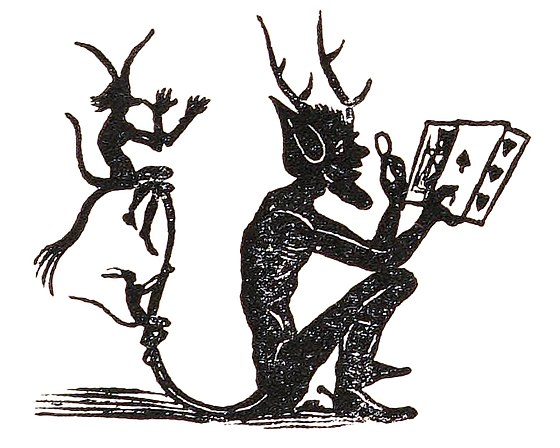

 

## An imp approaches out of thin air...

He offers to play a game with you. 

In the game, the imp gives you a die to roll. He will give you a dollar if you roll a 1, 2 dollars if you roll a two, etc. 

He tells you that the game costs three dollars to play. You are indifferent between losing a dollar and gaining a dollar. 

Should you play the game?

If you aren't sure, how could you figure out?

Your first thought should be, if I roll a die, I need to make 3 dollars or more per roll for this game to be worth it. So know the question becomes, how can you figure out how much money you should expect to make per roll. 

# Hello expected value!
When we weight every outcome by its chance of occuring, we have found the *expected value* of the action.

Assuming you know what an average is, you might be thinking, isn't this just the average? Why do we have this fancy name for it? 

If you had that thought, congratulations! you are correct. In this case. 

  
  
  
  
  
  
  
  

# Hi!

The reason is that an average is a *specific* type of expected value. 

When we have a bunch of outcomes that are equally likely to occur, we don't have to individually weight each outcome. 
Rather we can do the more familiar (in the case of die) (1+2+3+4+5+6)/6. 
And if you are confused, remember that 1x1/6 + .... + 6x1/6 = (1+2+3+4+5+6)/6

# But what if the dice weren't fair?

When we roll a die, we know there are 6 possible outcomes. 

| Side  |
| ------------- |
| 1 |
| 2 |
| 3 |
| 4 |
| 5 |
| 6 |

But that isn't all we know...

We also know that each outcome has an equal chance of occuring. 

When we weight every outcome by its chance of occuring, we have found the *expected value* of the action.

| Side  | probability | product  | 
| ------------- | ------------- | ------------- |
| 1 | 1/6  | 1/6  | 
| 2  | 1/6  | 2/6 | 
| 3 | 1/6  | 3/6  | 
| 4  | 1/6  | 4/6 | 
| 5 | 1/6  | 5/6  | 
| 6  | 1/6  | 6/6 | 

We sum up the products to get the expected value.

Answer: 3.5

