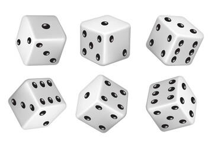

  

## An imp approaches out of thin air...

He offers to play a game with you. 

In the game, the imp gives you a die to roll. He will give you a dollar if you roll a 1, 2 dollars if you roll a two, etc. 

He tells you that the game costs three dollars to play. You are indifferent between losing a dollar and gaining a dollar. 

Should you play the game?

| Side  | probability | product  | 
| ------------- | ------------- | ------------- |
| 1 | 1/6  | 1/6  | 
| 2  | 1/6  | 2/6 | 
| 3 | 1/6  | 3/6  | 
| 4  | 1/6  | 4/6 | 
| 5 | 1/6  | 5/6  | 
| 6  | 1/6  | 6/6 | 

What is the average number that will appear if you roll a die?

We sum up the products to get the expected value 

Answer: 3.5
