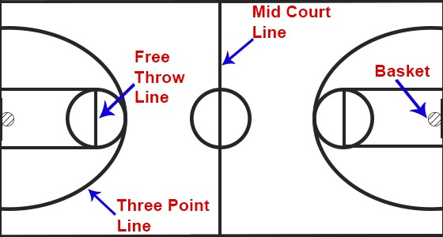
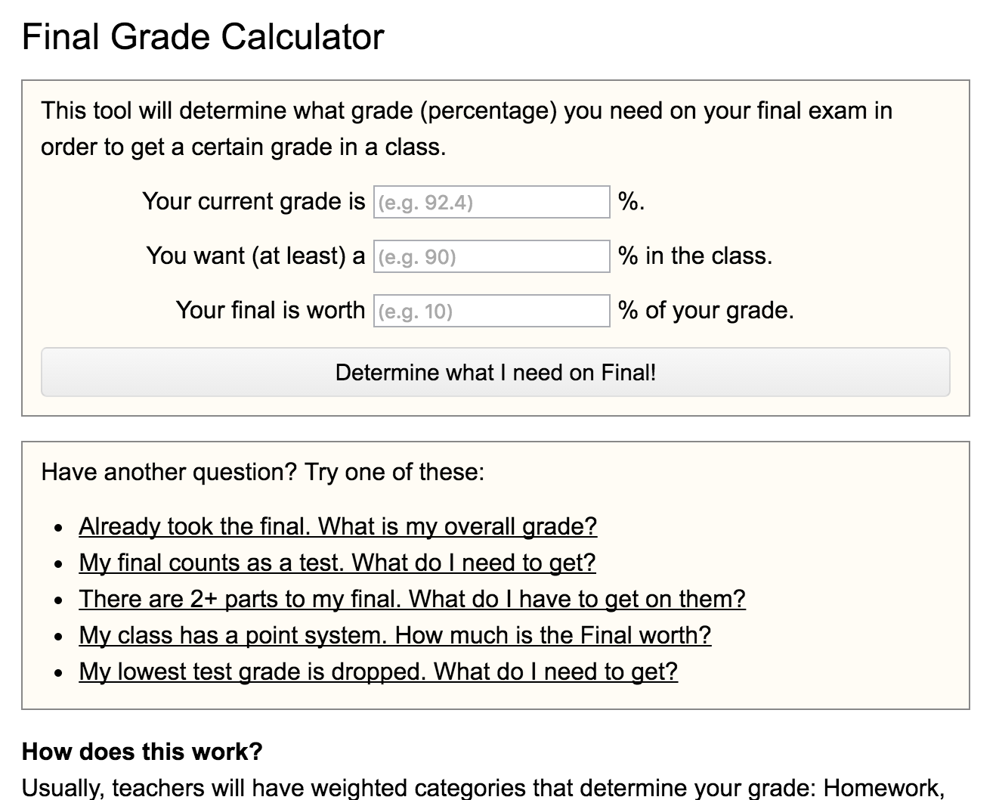

You are a basketball player. In basketball there are two types of shots. Three point shots are further away, and correspondingly harder than two point shots. 

You are about to shoot the ball, and are deciding whether to take a two pointer or a three pointer. In your career, you have shot 35% on 3s and 50% on 2s. Which shot should you take?

Enter expected value. 

Expected value is a weighted average. What is an average and what does it mean to be weighted?

Take the following example: There are 4 students in a class who just took their final. The students got grades of 25 50 75 and 100. The average is 50, because 25+50+75+100 = 200 and 200/4 = 50. This might seem obvious but there is a subtle, implicit assumption when calculating average. Each data point (student grade) is valued equally. This is why we can divide the sum of the data points by 4. 

But now the student who recived a 25 is stressing about if they will pass, and is trying to calculate their final grade. Homework and participation make up 50 and 30 percent of the grade. The final is worth the remaining 20%. 

The student recieved 90% participaton and a 80% homework. 70% is the minimum passing grade in the class. Will the student pass? Why or why not?

The average of the 3 grades is 

90+80+25 = 195 -> 195/3 = 65

So is the student failing? 

No. The student is not failing because their final grade is not the average of the final, homework, and participation grades. 
It is the *Weighted Average* of those three grades. Unlike regular average, a weigthed average does not assume all data points are equally important. 

The weighted average is (.2 x 25) + (.5 x 80) + (.3 x 90) = 12.5 + 40 + 27 = 79.5 

Expected value and weighted average are relatively interchangeable terms. Ussually, when we are talking about an event that hasn't happened yet, and the weights aren't based on importance but rather probability of occurance, we use expected value.

Back to basketball - Unlike the students grade, you haven't taken the shot yet. The student absolutely has a 79.5, where as you don't know if you have 2, 3, or 0 points. Still, we can use expected value to make a decision, with the probability of the shot as the weights. 

If we take a 3, there are two outcomes, a make, which happens 30% and gives us 3 points, and a miss, which happens 65% and gives us 0 points. 
If we take a 2, there are two outcomes, a make, which happens 50% and gives us 2 points, and a miss, which happens 50% and gives us 0 points. 

Thus a three is worth (.35 x 3) + (.7 x 0) = 1.05 points and a two is worth (.5 x 2 points) + (.5 x 0) = 1

So you should take the three.

