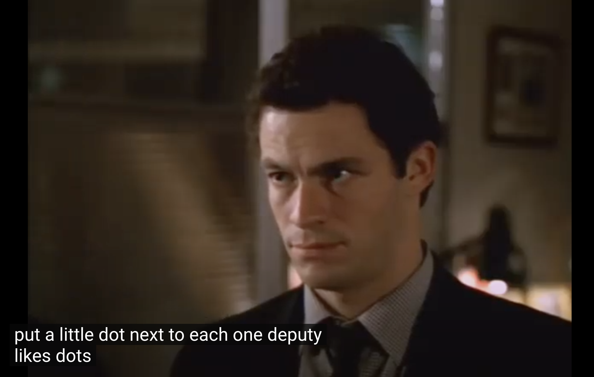

<!-- 
TODO: 
1) Game tree for each decision point in analytical version and full one above
2) Why make opponent indifferent? 
3) Tables to show y and x and y and z relative to each other 
4) Deviations e.g. player who never bluffs 
5) Compare to rule-based
6) That is, there are $$ 2^64 $$ strategy combinations. (??)
7) Lin alg example
-->

## Kuhn Poker

**Kuhn Poker** is the most basic poker game with interesting strategic implications. 

The game in its standard form is played with 3 cards {A, K, Q} and 2 players. Each player starts with $\2 and places an ante (i.e., forced bet before the hand) of $\1. And therefore has $1 left to bet with. Each player is then dealt 1 card and 1 round of betting ensues. 

The rules in bullet form: 
- 2 players
- 3 card deck {A, K, Q}
- Each starts the hand with $2
- Each antes (i.e., makes forced bet of) $1 at the start of the hand
- Each player is dealt 1 card
- Each has $1 remaining for betting
- There is 1 betting round and 1 bet size of $1
- The highest card is the best (i.e., A $>$ K $>$ Q)

Action starts with P1, who can Bet $1 or Check
- If P1 bets, P2 can either Call or Fold
- If P1 checks, P2 can either Bet or Check
- If P2 bets after P1 checks, P1 can then Call or Fold

- If a player folds to a bet, the other player wins the pot of $2 (profit of 1)
- If both players check, the highest card player wins the pot of $2 (profit of $1)
- If there is a bet and call, the highest card player wins the pot of $4 (profit of $2)

The following sequences are possible. 

The "History full" shows the exact betting history with "k" for check, "b" for bet, "c" for call, "f" for fold.

The "History short" uses a condensed format that uses only "b" for betting/calling and "p" (pass) for checking/folding, meaning that "b" is used when putting $1 into the pot and "p" when putting no money into the pot. We reference this shorthand format since we'll use it when putting the game into code. 

| P1  | P2  | P1  | Pot size  | Result  | History full | History short
|---|---|---|---|---|---|---|
| Check  | Check  | --   | $2  | High card wins $1  | kk  | pp  | 
| Check  | Bet $1  | Call $1  | $4  | High card wins $2  | kbc  | pbb  | 
| Check  | Bet $1  | Fold  | $2  | P2 wins $1 | kbf  | pbp  | 
| Bet $1  | Call $1  | --  | $4  | High card wins $2  | bc  | bb  | 
| Bet $1  | Fold  | --  | $2  | P1 wins $1  | bf  | bp  | 

## Solving Kuhn Poker
We're going to solve for the GTO solution to this game using 3 methods, an analytical solution, a normal form solution, and then we will introduce game trees, which allows for solving the game using the CFR counterfactual regret algorithm, that will be detailed more in the next section. 

What's the point of solving such a simple game? We can learn some important poker principles even from this game, although they are most useful for beginner players. We can also see the limitations of these earlier solving methods and how new methods were needed to solve games of even moderate size. 

### Analytical Solution 
There are 4 decision points in this game: P1's opening action, P2 after P1 bets, P2 after P1 checks, and P1 after checking and P2 betting. 

Let's first look at P1's opening action. P1 should never bet the K card here because if he bets the K, P2 with Q will always fold (since the lowest card can never win) and P2 with A will always call (since the best card will always win). By checking the K always, P1 can try to induce a bluff from P2 when P2 has the Q. 

**P1 initial action**

Therefore we assign P1's strategy:
- Bet Q: $$x$$
- Bet K: $$0$$
- Bet A: $$y$$

**P2 after P1 bet**

After P1 bets, P2 should always call with the A and always fold the Q as explained above. 

Therefore we assign P2's strategy after P1 bet:
- Call Q: $$0$$
- Call K: $$a$$
- Call A: $$1$$

**P2 after P1 check**

After P1 checks, P2 should never bet with the K for the same reason as P1 should never initially bet with the K. 

P2 should always bet with the A because it is the best hand and there is no bluff to induce by checking (the hand would simply end and P2 would win, but not have a chance to win more by betting). 

Therefore we assign P2's strategy after P1 check:
- Bet Q: $$b$$
- Bet K: $$0$$
- Bet A: $$1$$

**P1 after P1 check and P2 bet**

This case is similar to P2's actions after P1's bet. P1 can never call here with the worst hand (Q) and must always call with the best hand (A). 

Therefore we assign P1's strategy after P1 check and P2 bet:
- Call Q: $$0$$
- Call K: $$z$$
- Call A: $$1$$

So we now have 5 different variables $$x, y, z$$ for P1 and $$a, b$$ for P2 to represent the unknown probabilities. 

**Solving for $$x$$ and $$y$$**

For P1 opening the action, $$x$$ is his probability of betting with Q (bluffing) and $$y$$ is his probability of betting with A (value betting). A key game theory principle is that we want to make P2 indifferent between calling and folding with the K (since again, Q is always a fold and A is always a call for P2). 

Why do we want to make the opponent indifferent? This means that the opponent cannot exploit our strategy...

When P2 has K, P1 has $$ \frac{1}{2} $$ of having a Q and A each. 

P2's EV of folding with a K to a bet is $$ 0 $$. Note that we are defining EV from the current decision point, meaning that money already put into the pot is sunk and not factored in. 

P2's EV of calling with a K to a bet $$ = 3 * \text{P(P1 has Q and bets with Q)} + (-1) * \text{P(P1 has A and bets with A)} $$

$$ = (3) * \frac{1}{2} * x + (-1) * \frac{1}{2} * y $$

Setting the calling and folding EVs equal, we have: 

$$ 0 = (3) * \frac{1}{2} * x + (-1) * \frac{1}{2} * y $$

$$ y = 3 * x $$

That is, P1 should bet the A 3 times more than bluffing with the Q. This result is parametrized, meaning that there isn't a fixed number solution, but rather a ratio of how often P1 should value-bet compared to bluff. For example, if P1 bluffs with the Q 10% of the time, he should value bet with the A 30% of the time.  

**Solving for $$a$$**

$$a$$ is how often P2 should call with a K facing a bet from P1. 

P2 should call $$a$$ to make P1 indifferent to bluffing (i.e., betting or checking) with card Q. 

If P1 checks with card Q, P1 will always fold afterwards if P2 bets (because it is the worst card and can never win), so P1's EV is 0. 

$$ \text{EV P1 check with Q} = 0 $$     

If P1 bets with card Q, 

$$
\text{EV P1 bet with Q} = (-1) * \text{P2 has A and always calls/wins} + (-1) * \text{P2 has K and calls/wins} + 2 * \text{P2 has K and folds}

= \frac{1}{2} * (-1) + \frac{1}{2} * (a) * (-1) + \frac{1}{2} * (1 - a) * (2)

= -\frac{1}{2} - \frac{1}{2} * a + (1 - a)

= \frac{1}{2} - \frac{3}{2} * a
$$

Setting the probabilities of betting with Q and checking with Q equal, we have:
$$
0 = \frac{1}{2} - \frac{3}{2} * a  

\frac{3}{2} * a   = \frac{1}{2}

a = \frac{1}{3}
$$

Therefore P2 should call $$\frac{1}{3}$$ with a K when facing a bet from P1. 

**Solving for $$b$$**

Now to solve for $$b$$, how often P2 should bet with a Q after P1 checks. The indifference for P1 is only relevant when he has a K, since if he has a Q or A, he will always fold or call, respectively. 

If P1 checks a K and then folds, then: 

$$ \text{EV P1 check with K and then fold to bet} = 0 $$  

If P1 checks and calls, we have: 

$$ \text{EV P1 check with K and then call a bet} = (-1) * \text{P(P2 has A and always bets) + (3) * P(P2 has Q and bets)

= \frac{1}{2} * (-1) + \frac{1}{2} * b * (3) $$

Setting these probabilities equal, we have:
$$ 0 = \frac{1}{2} * (-1) + \frac{1}{2} * b * (3) $$

$$ \frac{1}{2} = \frac{1}{2} * b * (3) $$

$$ 3 * b = 1 $$

$$ b = \frac{1}{3} $$

Therefore P2 should bet $$\frac{1}{3}$$ with a Q after P1 checks.

**Solving for $$z$$**
The final case is when P1 checks a K, P2 bets, and P1 must decide how frequently to call so that P2 is indifferent to checking vs. betting (bluffing) with a Q. 

(Note that | denotes "given that" and we use the conditional probability formula of $$\P(A|B) = \frac{P(A \cup B)}{P(B)}$$ where $$\cup$$ denotes the intersection of the sets, so in this case is where $$A$$ and $$B$$ intersect)

We start with finding the probability that P1 has an A given that P1 has checked and P2 has a Q, meaning that P1 has an A or K. 

$$ \text{P(P1 has A | P1 checks A or K)} = \frac{\text{P(P1 has A and checks)}}{\text{P(P1 checks A or K)}} $$

$$ = \frac{(1-y) * \frac{1}{2}}{(1-y) * \frac{1}{2} + \frac{1}{2}} $$

$$ = \frac{1-y}{2-y} $$

$$ \text{P(P1 has K | P1 checks A or K)} = 1 - \text{P(P1 has A | P1 checks A or K)} $$

$$ = 1 - \frac{1-y}{2-y} $$

$$ = \frac{2-y}{2-y} - \frac{1-y}{2-y} $$

$$ = \frac{1}{2-y} $$

If P2 checks his Q, his EV $$ = 0 $$.

If P2 bets (bluffs) with his Q, his EV is:

$$ -1 * P(P1 check A then call A) - 1 * P(P1 check K then call K) + 2 * P(P1 check K then fold K) $$

$$ = -1 * \frac{1-y}{2-y} + -1 * z * \frac{1}{2-y} + 2 * (1-z) * \frac{1}{2-ya} $$

Setting these equal:

$$ 0 = -1 * \frac{1-y}{2-y} + -1 * z * \frac{1}{2-y} + 2 * (1-z) * \frac{1}{2-y} $$

$$ 0 = -1 * \frac{1-y}{2-y} + -1 * z * \frac{1}{2-y} + 2 * (1-z) * \frac{1}{2-y} $$

$$ 0 = -\frac{1-y}{2-y} - z * \frac{3}{2-y} + \frac{2}{2-y} $$ 

$$ z * \frac{3}{2-y} = \frac{2}{2-y} - \frac{1-y}{2-y} $$

$$ z = \frac{2}{3} - \frac{1-y}{3}

$$ z = \frac{y+1}{3} $$

So P1 should call with a K relative to the proportion of betting an A. This means if betting A 50% of the time ($$y=0.5$$), we would have $$z = \frac{1.5}{3} = 0.5$$ as well. 

**Summary**

We now have the following result:

P1 initial actions: 

Bet Q: $$x = \frac{y}{3} $$

Bet A: $$ y = 3*x $$

P2 after P1 bet: 

Call K: $$ a = \frac{1}{3} $$

P2 after P1 check: 

Bet Q: $$ b = \frac{1}{3} $$

P1 after P1 check and P2 bet: 

Call K: $$ z = \frac{y+1}{3} $$

P2 has fixed actions, but P1's are dependent on the $$ y $$ parameter. 

We can look at the expected value of every possible deal-out to evaluate the value for $$ y $$. We format these EV calculations as $$\text{P1 action} * \text{P2 action} * \text{P1 action if applicable} * \text{$$ won}.

**Case 1: P1 A, P2 K**

1. Bet fold
$$ y * \frac{2}{3} * 2 = \frac{y}{3} $$

2. Bet call
$$ y * \frac{1}{3} * 3 = 2 * y $$

3. Check check
$$ (1 - y) * 1 * 2 = 2 * (1 - y) $$

Total = $$ \frac{y}{3} + 2 $$

**Case 2: P1 A, P2 Q**
1. Bet fold
$$ y * 1 * 2 = 2 * y $$

2. Check bet call
$$ (1 - y) * \frac{1}{3} * 1 * 3 = 3 * \frac{1}{3} * (1 - y) $$

3. Check check
$$ (1 - y) * \frac{2}{3} * 2 = 2 * \frac{2}{3} * (1 - y) $$
 
Total = $$ 2 * y + (1 - y) + \frac{4}{3} * (1-y) = \frac{1}{3} * (7 - y) $$

**Case 3: P1 K, P2 A**
1. Check bet call
$$ (1) * (1) * \frac{y+1}{3} * (-1) = -\frac{y+1}{3} $$

2. Check bet fold
$$ (1) * (1) * (1 - \frac{y+1}{3}) * (0) = 0 $$

Total = -\frac{y+1}{3} $$

**Case 4: P1 K, P2 Q**
1. Check check
$$ (1) * \frac{2}{3} * 2 = 2 * \frac{2}{3} $$

2. Check bet call
$$ (1) * \frac{1}{3} * \frac{y+1}{3} * 3 = \frac{y+1}{3} $$

3. Check bet fold
$$ (1) * \frac{1}{3} * (1 - \frac{y+1}{3}) * 0 = 0 $$

Total = \frac{4}{3} + \frac{y+1}{3} = \frac{y+5}{3} $$

**Case 5: P1 Q, P2 A**
1. Bet call
$$ \frac{y}{3} * 1 * (-1) = \frac{-*y}{3} $$

2. Check bet fold
$$ (1 - \frac{y}{3}) * 1 * 1 * (0) = 0 $$

Total = \frac{-y}{3} $$

**Case 6: P1 Q, P2 K**
1. Bet call
$$ \frac{y}{3} * \frac{1}{3} * (-1) = -\frac{y}{9} $$

2. Bet fold
$$ \frac{y}{3} * \frac{2}{3} * 2 = \frac{4*y}{9} $$

3. Check check
$$ (1-\frac{y}{3}) * 1 * (0) = 0 $$ 

Total = -\frac{y}{9} + \frac{4*y}{9} = \frac{y}{3} $$

**Summing up the cases**
Since each case is equally likely based on the initial deal, we can multiply each by $$ \frac{1}{6} $$ and then sum them to find the EV of the game. Summing up all cases, we have:

Overall total = $$ \frac{1}{6} * [\frac{y}{3} + 2 + \frac{1}{3} * (7 - y) + -\frac{y+1}{3} + \frac{y+5}{3} + \frac{-y}{3} + \frac{y}{3}] = \frac{17}{18} $$

**Main takeaways**
What does this number $$ \frac{17}{18} $$ mean? It says that the expectation of the game from the perspective of Player 1 is $$ \frac{17}{18} $$. Since this is $$ <1 $$, we see that the expectation of Player 1 is $$ 1 - \frac{17}{18} = -0.05555 $$. Therefore the value of the game for Player 2 is $$ +0.05555 $$. Every time that these players play a hand against each other, that will be the outcome on average -- meaning P1 will lose $5.56 on average per 100 hands and P2 will gain that amount. 

The expected value is not at all dependent on the $$ y $$ variable which defines how often Player 1 bets his A hands. If we assumed that the pot was not a fixed size of $2 to start the hand, then it would be optimal for P1 to either always bet or always check the A (the math above would change and the result would depend on $$y$$), but we'll stick with the simple case of the pot always starting at $2 from the antes. 

From a poker strategy perspective, the main takeaway is that we can essentially split our hands into:
1. Strong hands
2. Mid-strength hands
3. Weak hands

Mid-strength hands can win, but don't want to build the pot. Strong hands try to generally make the pot large with value bets. Weak hands want to either give up or be used as bluffs. 

Note that this mathematically optimal solution automatically uses bluffs. Bluffs are not -EV bets that are used as "bad plays" to get more credit for value bets later, they are in fact part of an overall optimal strategy. 

A faster way to compute the strategy for this game is putting the game into normal form. 

balancing bluffs

### Kuhn Poker in Normal Form

**Information Sets**

There are 6 possible deals in Kuhn Poker: AK, AQ, KQ, KA, QK, QA. 

Each player has 2 decision points in the game. Player 1 has the initial action and the action after the sequence of P1 checks --> P2 bets. Player 2 has the second action after Player 1 bets or Player 1 checks. 

Therefore each player has 12 possible acting states. For player 1 these are: 
1. AK acting first
2. AQ acting first
3. KQ acting first
4. KA acting first
5. QK acting first
6. QA acting first
7. AK check, P2 bets, P1 action
8. AQ check, P2 bets, P1 action
9. KQ check, P2 bets, P1 action
10. KA check, P2 bets, P1 action
11. QK check, P2 bets, P1 action
12. QA check, P2 bets, P1 action

However, the state of the game is not actually known to the players! Each player has 2 decision points that are equivalent from their point of view, even though the true game state is different. For player 1 these are:
1. A acting first (combines AK and AQ)
2. K acting first (combines KQ and KA)
3. Q acting first (combines QK and QA)
4. A check, P2 bets, P1 action (combines AK and AQ)
5. K check, P2 bets, P1 action (combines KQ and KA)
6. Q check, P2 bets, P1 action (combines QK and QA)

From Player 1's perspective, she only knows her own private card and can only make decisions based on knowledge of this card.

For example, if Player 1 is dealt a K and Player 2 dealt a Q or P1 dealt K and P2 dealt A, P1 is facing the decision of having a K and not knowing what the opponent has. 

Likewise if Player 2 is dealt a K and is facing a bet, he must make the same action regardless of what the opponent has because from his perspective he only knows his own card. 

We define an information set as the set of information used to make decisions at a particular point in the game. In Kuhn Poker, it is equivalent to the card of the acting player and the history of actions up to that point. 

When writing game history sequences, we use "k" to define check, "b" for bet", "f" for fold, and "c" for call. So for Player 1 acting first with a K, the information set is "K". For Player 2 acting second with an A and facing a bet, the information set is "Ab". For Player 2 acting second with a A and facing a check, the information set is "Ak". For Player 1 with a K checking and facing a bet from Player 2, the information set is "Kkb". 

The shorthand version is to combine "k" and "f" into "p" for pass and to combine "b" and "c" into "b" for bet. Pass indicates putting no money into the pot and bet indicates putting $1 into the pot. 

**Writing Kuhn Poker in Normal Form** 

Now that we have defined information sets, we see that each player in fact has 2 information sets per card that he can be dealt, which is a total of 6 information sets per player since each can be dealt a card in {Q, K, A}. 

Each information set has 2 actions possible, which are essentially "do not put money in the pot" (check when acting first/facing a check or fold when facing a bet -- we call this pass) and "put in $1" (bet when acting first or call when facing a bet -- we call this bet). 

The result is that each player has $$ 2^6 = 64 $$ total combinations of strategies. Think of this as each player having a switch between pass/bet for each of the 6 information sets that can be on or off and deciding all of these in advance. 

Here are a few examples of the 64 strategies for Player 1 (randomly selected): 

1. A - bet, Apb - bet, K - bet, Kpb - bet, Q - bet, Qpb - bet 
2. A - bet, Apb - bet, K - bet, Kpb - bet, Q - bet, Qpb - pass 
3. A - bet, Apb - bet, K - pass, Kpb - bet, Q - bet, Qpb - bet 
4. A - bet, Apb - pass, K - bet, Kpb - pass, Q - bet, Qpb - bet 
5. A - bet, Apb - pass, K - bet, Kpb - bet, Q - bet, Qpb - bet 
6. A - pass, Apb - bet, K - bet, Kpb - bet, Q - pass, Qpb - bet 

We can create a $$ 64 \text{x} 64 $$ payoff matrix with every possible strategy for each player on each axis and the payoffs inside.

| P1/P2  | P2 Strat 1  | P2 Strat 2 | ... | P2 Strat 64 |
|---|---|---|---|---|
| P1 Strat 1  | EV(1,1)  | EV(1,2)  | ...  | EV(1,64)  |
| P1 Strat 2  | EV(2,1)  | EV(2,2) | ...  | EV(2,64) |
| ...  | ...  | ...  | ...  | ... |
| P1 Strat 64 | EV(64,1)  | EV(64,2)  | ...  | EV(64,64) |

This matrix has 4096 entries and would be difficult to use for something like iterated elimination of dominated strategies. We turn to linear programming to find a solution.

**Solving with Linear Programming**

The general way to solve a game matrix of this size is with linear programming, which is essentially a way to optimize a linear objective, which we'll define below. This kind of setup could be used in a problem like minimizing the cost of food while still meeting objectives like a minimum number of calories and maximum number of carbohydrates and sugar. 

We can define Player 1's strategy as $$ x $$, which is a vector of size 64 corresponding to the probability of playing each strategy. We do the same for Player 2 as $$ y $$. 

We define the payoff matrix as $$ A $$ with the payoffs written with respect to Player 1. 

$$ A = 
\quad
\begin{bmatrix} 
EV(1,2) & EV(1,2) & ... & EV(1,64) & \\
EV(2,1) & EV(2,2) & ... & EV(2,64) & \\
... & ... & ... & ... & \\
EV(64,1) & EV(64,2) & ... & EV(64,64) & \\
\end{bmatrix}
$$

We can also define payoff matrix $$ B $$ for payoffs written with respect to Player 2 -- in zero-sum games like poker, $$ A = -B$$.

We can also define a constraint matrix for each player:

Let P1's constraint matrix = $$ E $$ such that $$ Ex = e $$ 

Let P2's constraint matrix = $$ F $$ such that $$ Fy = f $$ 

The only constraint we have at this time is that the sum of the strategies is 1 since they are a probability distribution, so E and F will just be vectors of 1's and e and f will $$ = 1 $$. In effect, this is just saying that each player has 64 strategies and should play each of those some % of the time and these %s have to add up to 1 since this is a probability distribution and probabilities always add up to 1. 

In the case of Kuhn Poker, for **step 1** we look at a best response for player 2 (strategy y) to a fixed Player 1 (strategy x) and have:

$$ \max_{y} (x^TB)y $$

$$ = \max_{y} (x^T(-A))y  $$

$$ = \min_{y} (x^T(A))y $$
$$ \text{Such that: } Fy = f, y \geq 0 $$ 

In words, this is the expected value of the game from Player 2's perspective because the $$ x $$ and $$ y $$ matrices represent the probability of ending in each state of the payoff matrix and the $$ B == -A $$ value represents the payoff matrix itself. So Player 2 is trying to find a strategy $$ y $$ that maximizes the payoff of the game from his perspective against a fixed $$ x $$ player 1 strategy. 

For **step 2**, we look at a best response for player 1 (strategy x) to a fixed player 2 (strategy y) and have: 

$$ \max_{x} x^T(Ay) $$
$$ \text{Such that: } x^TE^T = e^T, x \geq 0 $$

For the final step, we can combine the above 2 parts and now allow for $$ x $$ and $$ y $$ to no longer be fixed. 

$$ \min_{y} \max_{x} [x^TAy] $$

$$ \text{Such that: } x^TE^T = e^T, x \geq 0, Fy = f, y \geq 0 $$

We can solve this with linear programming, but there is a much nicer way to do this!

**Simplifying the Matrix** 

Kuhn Poker is the most basic poker game possible and requires solving a $$ 64 \text{x} 64 $$ matrix. While this is feasible, any reasonably sized poker game would blow up the matrix size! 

We can improve on this form by considering the structure of the game tree. Rather than just saying that the constraints on the $$ x $$ and $$ y $$ matrices are that they must sum to 1, we can redefine these conditions according to the structure of the game tree. 

Previously we defined $$ E = F = \text{Vectors of } 1 $$. However, we know that some strategic decisions can only be made after certain other decisions have already been made. For example, Player 2's actions after a bet can only be made after Player 1 has first bet! 

Now we can redefine $$ E $$ as follows:

| Infoset/Strategies | 0  | A_b | A_p  | A_pb  | A_pp  | K_b  | K_p  | K_pb  | K_pp  | Q_b  | Q_p  | Q_pb  | Q_pp  |
|---|---|---|---|---|---|---|---|---|---|---|---|---|---|
| 0  | 1  |   |   |   |   |   |   |   |   |   |   |   |   |
| A  | -1  | 1  | 1  |   |   |   |   |   |   |   |   |   |   |
| Apb  |   |   | -1  | 1  | 1  |   |   |   |   |   |   |   |   |
| K  | -1   |   |   |   |   | 1  | 1  |   |   |   |   |   |   |
| Kpb  |   |   |   |   |   |   | -1  | 1  | 1  |   |   |   |   |
| Q  | -1  |   |   |   |   |  |   |   |   | 1  | 1  |   |   |
| Qpb  |   |   |   |   |   |   |   |   |   |   | -1  | 1  | 1  |

We see that $$ E $$ is a $$ 7 \text{x} 13 $$ matrix. 

$$ E = 
\quad
\begin{bmatrix} 
1 & 0 & 0 & 0 & 0 & 0 & 0 & 0 & 0 & 0 & 0 & 0 & 0 \\
-1 & 1 & 1 & 0 & 0 & 0 & 0 & 0 & 0 & 0 & 0 & 0 & 0 \\
0 & 0 & -1 & 1 & 1 & 0 & 0 & 0 & 0 & 0 & 0 & 0 & 0 \\
-1 & 0 & 0 & 0 & 0 & 1 & 1 & 0 & 0 & 0 & 0 & 0 & 0 \\
0 & 0 & 0 & 0 & 0 & 0 & -1 & 1 & 1 & 0 & 0 & 0 & 0 \\
-1 & 0 & 0 & 0 & 0 & 0 & 0 & 0 & 0 & 1 & 1 & 0 & 0 \\
0 & 0 & 0 & 0 & 0 & 0 & 0 & 0 & 0 & 0 & -1 & 1 & 1 \\
\end{bmatrix}
$$

$$ x $$ is a $$ 13 \text{x} 1 $$ matrix of probabilities to play each strategy.

$$ x = 
\quad
\begin{bmatrix} 
1 \\
A_b \\
A_p \\
A_{pb} \\
A_{pp} \\
K_b \\
K_p \\
K_{pb} \\
K_{pp} \\
Q_b \\
Q_p \\
Q_{pb} \\
Q_{pp} \\
\end{bmatrix}
$$

We have finally that $$ e $$ is a $$ 7 \text{x} 1 $$ fixed matrix. 

$$ e = 
\quad
\begin{bmatrix} 
1 \\
0 \\
0 \\
0 \\
0 \\
0 \\
0 \\
\end{bmatrix}
$$

So we have:

$$
\quad
\begin{bmatrix} 
1 & 0 & 0 & 0 & 0 & 0 & 0 & 0 & 0 & 0 & 0 & 0 & 0 \\
-1 & 1 & 1 & 0 & 0 & 0 & 0 & 0 & 0 & 0 & 0 & 0 & 0 \\
0 & 0 & -1 & 1 & 1 & 0 & 0 & 0 & 0 & 0 & 0 & 0 & 0 \\
-1 & 0 & 0 & 0 & 0 & 1 & 1 & 0 & 0 & 0 & 0 & 0 & 0 \\
0 & 0 & 0 & 0 & 0 & 0 & -1 & 1 & 1 & 0 & 0 & 0 & 0 \\
-1 & 0 & 0 & 0 & 0 & 0 & 0 & 0 & 0 & 1 & 1 & 0 & 0 \\
0 & 0 & 0 & 0 & 0 & 0 & 0 & 0 & 0 & 0 & -1 & 1 & 1 \\
\end{bmatrix}

\quad
\begin{bmatrix} 
1 \\
A_b \\
A_p \\
A_{pb} \\
A_{pp} \\
K_b \\
K_p \\
K_{pb} \\
K_{pp} \\
Q_b \\
Q_p \\
Q_{pb} \\
Q_{pp} \\
\end{bmatrix}

= 

\quad
\begin{bmatrix} 
1 \\
0 \\
0 \\
0 \\
0 \\
0 \\
0 \\
\end{bmatrix}
$$

To understand how the matrix multiplication works and why it makes sense, let's look at each of the 7 multiplications (i.e., each row of $$ E $$ multiplied by the column vector of $$ x $$ $$ = $$ the corresponding row in the $$ e $$ column vector. .

**Row 1**

We have $$ 1 \text{x} 1 $$ = 1. This is a "dummy" 

**Row 2**

$$ -1 + A_b + A_p = 0 $$
$$ A_b + A_p = 1 $$

This is the simple constraint that the probability between the initial actions in the game must sum to 1. 

**Row 3**
$$ -A_p + A_{pb} + A_{pp} = 1 $$
$$ A_{pb} + A_{pp} = A_p $$

The probabilities of Player 1 taking a bet or pass option with an A after initially passing must sum up to the probability of that initial pass $$ A_p$$. 

The following are just repeats of Rows 2 and 3 with the other cards. 

**Row 4**
 
$$ -1 + K_b + K_p = 0 $$
$$ K_b + K_p = 1 $$

**Row 5**
 
$$ -K_p + K_{pb} + K_{pp} = 1 $$
$$ K_{pb} + K_{pp} = K_p $$

**Row 6**
 
$$ -1 + Q_b + Q_p = 0 $$
$$ Q_b + Q_p = 1 $$

**Row 7**
 
$$ -Q_p + Q_{pb} + Q_{pp} = 1 $$
$$ Q_{pb} + Q_{pp} = Q_p $$

And $$ F $$:

| Infoset/Strategies | 0  | A_b(ab) | A_p(ab)  | A_b(ap)  | A_p(ap)  | K_b(ab)  | K_p(ab)  | K_b(ap)  | K_p(ap)  | Q_b(ab)  | Q_p(ab)  | Q_b(ap)  | Q_p(ap)  |
|---|---|---|---|---|---|---|---|---|---|---|---|---|---|
| 0  | 1  |   |   |   |   |   |   |   |   |   |   |   |   |
| Ab  | -1  | 1  | 1  |   |   |   |   |   |   |   |   |   |   |
| Ap  | -1   |   |   | 1  | 1  |   |   |   |   |   |   |   |   |
| Kb  | -1   |   |   |   |   | 1  | 1  |   |   |   |   |   |   |
| Kp  | -1  |   |   |   |   |   |   | 1  | 1  |   |   |   |   |
| Qb  | -1  |   |   |   |   |  |   |   |   | 1  | 1  |   |   |
| Qp  | -1  |   |   |   |   |   |   |   |   |   |   | 1  | 1  |

From the equivalent analysis as we did above with $$ Fx = f$$, we will see that each pair of 1's in the $$ F $$ matrix will sum to $$ 1 $$ since they are the 2 options at the information set node. 

Now instead of the $$ 64 \text{x} 64 $$ matrix we made before, we can represent the payoff matrix as only $$ 6 \text{x} 2 \text{ x } 6\text{x}2 = 12 \text{x} 12 $$.   

| P1/P2 | 0  | A_b(ab) | A_p(ab)  | A_b(ap)  | A_p(ap)  | K_b(ab)  | K_p(ab)  | K_b(ap)  | K_p(ap)  | Q_b(ab)  | Q_p(ab)  | Q_b(ap)  | Q_p(ap)  |
|---|---|---|---|---|---|---|---|---|---|---|---|---|---|
| 0  |   |   |   |   |   |   |   |   |   |   |   |   |   |
| A_b  |   |   |   |   |   | 2  | 1  |   |   | 2  | 1  |   |   |
| A_p  |   |   |   |   |   |   |   |   | 1  |   |   |   | 1  |
| A_pb  |    |   |   |   |   |   |   | 2 |   |   |   | 2  | 0  |
| A_pp  |    |   |   |   |   |   |   | -1  |   |   |   | -1  |   |
| K_b  |   | -2  | 1  |   |   |   |   |   |   | 2  | 1  |   |   |
| K_p  |   |   |   |   | -1  |  |   |   |   |   |   |   | 1  |
| K_pb  |   |   |   | -2  |   |   |   |   |   |   |   | 2  |   |
| K_pp  |   |   |   | -1  |   |   |   |   |   |   |   | -1  |   |
| Q_b  |    | -2  | 1  |  |  | -2  | 1  |   |   |   |   |   |   |
| Q_p  |   |   |   |   | -1  |   |   |   | -1  |   |   |   |   |
| Q_pb  |   |   |   | -2  |   |   |   | -2  |   |   |   |   |   |
| Q_pp  |   |   |   | -1  |   |   |   | -1  |   |   |   |   |   |

$$ A = 
\quad
\begin{bmatrix} 
0 & 0 & 0 & 0 & 0 & 0 & 0 & 0 & 0 & 0 & 0 & 0 & 0 \\
0 & 0 & 0 & 0 & 0 & 2 & 1 & 0 & 0 & 2 & 1 & 0 & 0 \\
0 & 0 & 0 & 0 & 0 & 0 & 0 & 0 & 1 & 0 & 0 & 0 & 1 \\
0 & 0 & 0 & 0 & 0 & 0 & 0 & 2 & 0 & 0 & 0 & 2 & 0 \\
0 & 0 & 0 & 0 & 0 & 0 & 0 & -1 & 0 & 0 & 0 & -1 & 0 \\
0 & -2 & 1 & 0 & 0 & 0 & 0 & 0 & 0 & 2 & 1 & 0 & 0 \\
0 & 0 & 0 & 0 & -1 & 0 & 0 & 0 & 0 & 0 & 0 & 0 & 1 \\
0 & 0 & 0 & -2 & 0 & 0 & 0 & 0 & 0 & 0 & 0 & 2 & 0 \\
0 & 0 & 0 & -1 & 0 & 0 & 0 & 0 & 0 & 0 & 0 & -1 & 0 \\
0 & -2 & 1 & 0 & 0 & -2 & 1 & 0 & 0 & 0 & 0 & 0 & 0 \\
0 & 0 & 0 & 0 & -1 & 0 & 0 & 0 & -1 & 0 & 0 & 0 & 0 \\
0 & 0 & 0 & -2 & 0 & 0 & 0 & -2 & 0 & 0 & 0 & 0 & 0 \\
0 & 0 & 0 & -1 & 0 & 0 & 0 & -1 & 0 & 0 & 0 & 0 & 0 \\
\end{bmatrix}
$$

We could even further reduce this by eliminating dominated strategies:

| P1/P2 | 0  | A_b(ab) | A_b(ap)  | A_p(ap)  | K_b(ab)  | K_p(ab)  | K_b(ap)  | K_p(ap)  | Q_b(ab)  | Q_p(ab)  | Q_b(ap)  | Q_p(ap)  |
|---|---|---|---|---|---|---|---|---|---|---|---|---|
| 0  |   |   |   |   |   |   |   |   |   |   |   |   |
| A_b  |   |   |   |   | 2  | 1  |   |   | 2  | 1  |   |   |
| A_p  |   |   |   |   |   |   |   | 1  |   |   |   | 1  |
| A_pb  |    |   |   |   |   |   | 2 |   |   |   | 2  | 0  |
| K_p  |   |   |   | -1  |  |   |   |   |   |   |   | 1  |
| K_pb  |   |   | -2  |   |   |   |   |   |   |   | 2  |   |
| K_pp  |   |   | -1  |   |   |   |   |   |   |   | -1  |   |
| Q_b  |    | 1  |  |  | -2  | 1  |   |   |   |   |   |   |
| Q_p  |   |   |   | -1  |   |   |   | -1  |   |   |   |   |
| Q_pp  |   |   | -1  |   |   |   | -1  |   |   |   |   |   |

For simplicity, let's stick with the original $$ A $$ payoff matrix and see how we can solve for the strategies and value of the game. 

Our linear program is as follows (the same as before, but now our $$ E $$ and $$ F $$ matrices have constraints based on the game tree and the payoff matrix $$ A $$ is smaller, evaluating when player strategies coincide and result in payoffs, rather than looking at every possible set of strategic options as we did before:

$$ \min_{y} \max_{x} [x^TAy] $$

$$ \text{Such that: } x^TE^T = e^T, x \geq 0, Fy = f, y \geq 0 $$

Rhode Island Hold'em 
Resutls with other poker agents playing worse strategies exploitable

Now we have shown a way to solve games more efficiently based on the structure/ordering of the decision nodes (which can be expressed in tree form).

Mixed vs behavioral strategies

