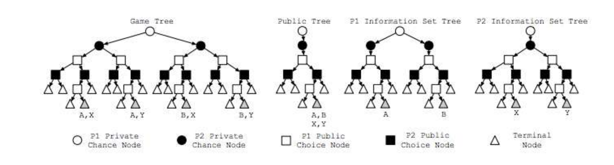
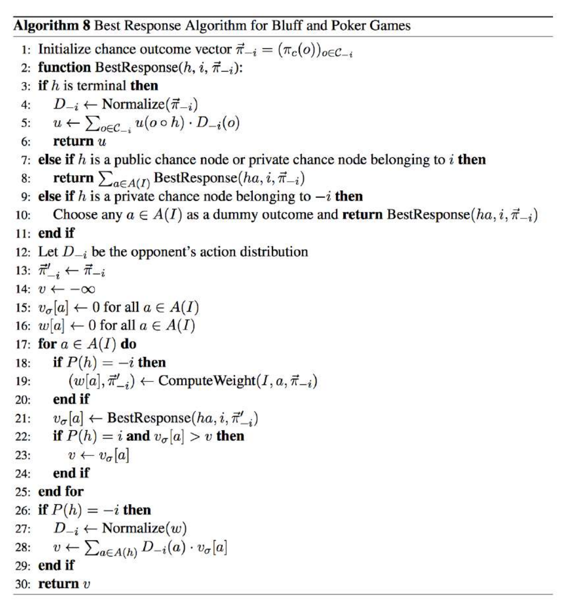

# CFR - Agent Evaluation
Poker results are generally measured in big blinds per 100 hands won. In the research
community, the standard measure is milli-big-blinds per hand (or per game), or
mbb/g, where one milli-big-blind is 1/1000 of one big blind. This is also used as a
measure of exploitability, the expected loss per game against a worst-case opponent.
A player who folds every hand will lose 750 mbb/g on average in a heads up match
(1000 mbb/g as big blind and 500 as small blind).

## Evaluating Poker Agents
There are three main ways to evaluate poker agents – against a best response
opponent, against other poker agents, and against human opponents. Evaluation can
be difficult due to the inherent variance in poker, but this can be minimized by
playing a very large number of hands and also by playing in a “duplicate” format,
where, for example, two agents would play a set of hands and then clear their
memories and play the same hands with the cards reversed. Further, an agent that
performs well in one evaluation metric is not guaranteed to perform well in others.

### Agent vs. Agent
Agent against agent is a common way to test the abilities of poker programs. This is
an empirical method for researchers to evaluate agents with different characteristics,
such as different abstractions. If a game theory optimal agent exists for a game then another agent could play against the GTO agent as a measure of quality. 

Researchers from around the world competed annually at the Annual Computer
Poker Competition that began in 2006 and is now part of the Poker
Workshop at the annual AAAI Conference on Artificial Intelligence. It has
competitions in limit, no-limit, and later 3 player Kuhn poker (most recently only nolimit competitions were played). This uses duplicate matches and two winner
determination methods – instant run-off eliminates the worst agent in each round and
bankroll gives the win to the agent with the highest bankroll in that event.
Researchers can also use testbed bots to evaluate performance.

### Human Opponents
The main issue with playing against human opponents is that win-rates can take
approximately one million hands to converge. The 2015 Man vs. Machine
competition involved 80,000 hands total against four opponents, which led to disputes
over statistical significance of the results.

Despite the difficulty of achieving very large hand samples against human opponents,
there is still value in these test games, as human experts are capable of quickly
analyzing a strategy and the playing statistics of that strategy, so a computer program
can be sanity checked and evaluated for unique tendencies by such human experts.
Computer programs could also be made available on the Internet to play against many
opponents to obtain significant levels of data. 

### Best Response
We can find the best response to a poker agent’s strategy analytically by having its
opponent always choose the action that maximizes expected value against the agent’s
strategy in all game states, given the agent’s strategy. We can then compute the � in
the e-Nash equilibria as a measure of exploitability that gives the lower bound on the
exploitability of the agent.

The purpose of calculating a best response is to choose actions to maximize our
expected value given an opponent’s entire strategy. The expectimax algorithm
involves a simple recursive tree walk where the probability of the opponent’s hand is
passed forward and the expected value for our states I returned, involving just one
pass over the entire game tree. 

To evaluate an extensive game strategy, the standard techniques have been to set up a
tournament between different agents or to evaluate worst case performance.
Best response is used to analytically evaluate performance in the worst case, often by
graphing exploitability against nodes touched or against time. Best response usually
requires a full tree traversal, but Johansen et al. showed a general technique that can
avoid this, since full tree traversal is often infeasible in very large games.

Best response has advantages over comparing strategies by competing them against
each other, due to the problems that come up with the latter such as intransitivities,
noise, and when there are multiple evaluation criteria.

The standard best response method involves examining each state once to compute
the value of every outcome, followed by a pass over the strategy space to determine
the optimal counter-strategy. 

This figure shows different trees representing Kuhn (1-card) poker. The left tree, titled
Game Tree, shows the exact state of the game. The squares are public nodes since
bets are made publicly, while the circles are private nodes since player cards are
private only to them. In the two rightmost trees (P1 and P2 Information Set Trees), the
opponent chance nodes have only one child each since their chance information is
unknown to the other player.

Instead of walking the full game tree or even the information set trees, we can
improve the algorithm by walking only the public tree and visiting each state only
once. When we reach a terminal node such as “A,B,X,Y”, this means that player 1
could be in nodes A or B as viewed by player 2 and that player 2 could be in nodes X
or Y as viewed by player 1. The algorithm calls for passing forward a vector of reach
probabilities of the opponent and chance and recursing back, while choosing the highest valued actions for the iteration player’s perspective and returning the sum of
child values for the opponent player, and then at the root, the returned value is the best
response to the opponent’s strategy.

Michael Johanson's paper describes techniques for accelerating best response calculations using
the structure of information and utilities to avoid a full game tree traversal, allowing
the algorithm to compute the worst case performance of non-trivial strategies in large
games. This can be done by traversing a different kind of tree, that allows more
opportunities for caching and reusing information, using properties of the game’s
utilities to efficiently evaluate terminal nodes of the public tree, using game specific
isomorphisms to reduce the size of the expanded tree, and solving independent
sections of this new tree in parallel.

The accelerated best response uses four ways to accelerate the computation. In our
Kuhn Poker best response algorithm, we will only be using the first method.
1. Taking advantage of what the opponent doesn’t know
- Walking only the public game tree
- Provides about a ~110x speedup in Texas Hold’em
2. Doing O(n^2) work in O(n) time
- Can use two for loops instead of two nested for loops by not iterating
over every possible hand combination
- Only need to know probability of opponent being in weaker or stronger
state
- 7.7x speedup in Texas Hold’em
3. Avoiding isomorphic game states
- Suits are all equivalent (meaning that AJ of spades is equivalent in strategy and strength to AJ of hearts, etc.)
- 21.5x reduction in game size
4. Parallel computation

The best response algorithm in the below figure takes as inputs the history of the actions,
the current player (the algorithm must be run for each player), and a distribution of the
opponent reach probabilities (line 2). An additional D variable is set on line 12 to
define the opponent’s action distribution. Then for each action possible, if the node
does not belong to the current player, then we iterate over each opponent possible
cards, find the probability of the player playing those cards, and update the reach
probability accordingly. A new variable w[a] is also introduced on line 19 to sum the
probabilities over all cards that are taking a certain action. Line 21 recurses over the
best response function to find the value of taking each action from that node, and then  on line 22-23, if that action value is better than the previous value (which is defaulted
at negative infinity), then it is assigned as the value for that node.

On lines 26-28, if the node is not the current player, then the w values are normalized
to define the opponent’s action distribution and the node is assigned a value according
to the action distribution and the node action values (i.e. this node’s value is assigned
with the normal weights, as opposed to the current player’s node value that is
assigned according to the best response method).

Finally, on lines 3-6, at terminal points, the opponent distribution is normalized,
values are assigned from the perspective of the iteration player, and the expected
value payoff is computed as a multiplication between the payoff and the normalized
opponent distribution

Here's how the algorithm works in practice in conjunction with CFR: 

1. Pause CFR intermittently
2. Call the best response function (BRF) for each player separately (this player is called the iterating player)
3. Iterate over all cards and sum all to get overall best respones for each iterating player
4. Pass to BRF: 
- Player card of iterating player
- Root starting history
- Which player is iterating player
- Vector of uniform reach probabilities of opponent hand possibilities
- Example in 5 card Kuhn poker: Player card = 3. Opponent vector = [0.25, 0.25, 0.25, 0, 0.25]
5. If at a terminal node, normalize the vector of the opponent reach probabilities and for each possible opponent hand, add the probability of that hand * the payoff from the iterating player’s perspective. Then return the expected payoff after going through all possible hands. 
6. If not at a terminal node, create the following: 
- D = [0, 0] to track the opponent's action distribution
- V = -inf for the value of the node
- New opponent reach probabiltiies that are initialized as a copy of the previous ones
- Util = [0, 0] to track the utility of each action
- W = [0, 0]
7. Iterate over the actions: 
- If the acting player is not the iterating player: 
- - Iterate over all hands of this player
- - Get the strategy of the actin gplayer for each hand based on what CFR has found up to now
- - Update the acting player reach probabilities multiplied by the strategy
- - W[action] += each of the new reach probabiltiies for this action
- Set the utility of this action to a recursive BRF call with the new history and new opponent reach (only changed if the acting player is not the iterating player)
- If the acting player is the iterating player and the utility of this action is higher than the current V, then set V = util[this action] since the iterating player will play the best pure strategy
8. If the acting player is not the iterating player: 
- D = the normalization of W over each action (i.e., D[0] = W[0]/(W[0] + W[1]))
- V = D[0] * util[0] * D[1] * util[1]
9. Return V