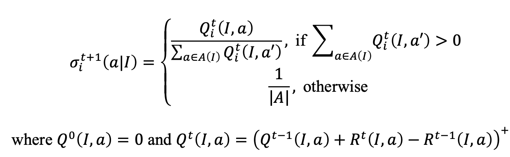
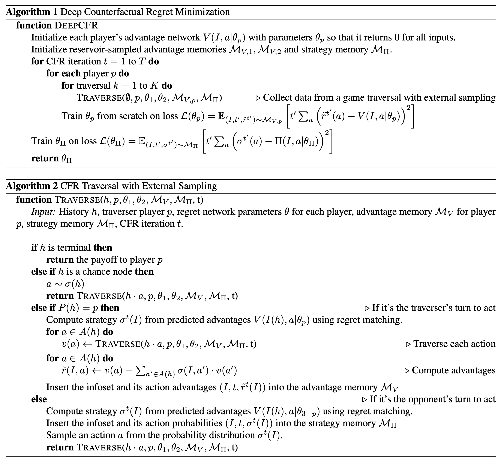

# CFR - CFR Advances
Now almost 15 years after the CFR algorithm was originally published by the University of Alberta in 2007, there have been a number of significant advances. Perhaps the most important was the use of Monte Carlo sampling that was discussed in the main CFR section, which allows the algorithm to work significantly faster. In Section 1.2 History of Solving Poker, we touched on some advances like strategy purification (always playing the best strategy instead of distributing strategy over a distribution), decomposition (analyzing different subgames independently), endgame solving (using a finer abstraction to solve the endgame part specifically), and warm starting CFR with a strategy that saves many iterations rather than starting with a uniform random strategy. 

Here we want to focus specifically on a few of the most important advancements. 

## CFR+
Oskari Tammelin, an independent researcher, first published a [paper about CFR+](https://arxiv.org/abs/1407.5042) in July, 2014, which was then popularized by the University of Alberta when they used it to completely solve Heads Up limit Hold'em Poker, one of the most majors breakthroughs in the field of poker research, which was [published in Science](http://webdocs.cs.ualberta.ca/~bowling/papers/15science.pdf) in January, 2015. 

This was the first time that a full, unabstracted game, that is regularly played in casinos was completely solved. While prior improvements to the vanilla CFR algorithm focused on sampling, CFR+
in fact does not rely on any sampling. CFR+ was found to be a good candidate for
using compression to address the memory challenges of tabular CFR since all values are updated at each iteration. This was used to sort
boards and private cards in order and to use prior values to predict the next values and
then store errors on the predicted values rather than their values directly. 

The main enhancement with CFR+ is that regret matching is replaced with newly
created regret matching plus (+). In short, any time an action's regret_sum goes negative, we reset it to 0. The regret matching concept remains the same and the difference is that the R regret
matching values are replaced by the new Q regret matching plus (+) values, which are
defined above in terms of R. The main difference is that each term calculated in the
regret matching is always non-negative, so future positive regrets are immediately
added to these values, rather than cancelling out accumulated negative regret. This
means that actions are chosen again after “proving themselves useful” again instead of
potentially becoming very negative and never having a chance to come back.

We can imagine an unlucky situation in poker that results in a large loss and CFR+ is essentially saying that we should act as if we haven't seen this situation before and would reset its regret sum to 0 to give it more chances to be useful. Regular CFR would put this move in a deep hole that could take a very, very long time to climb out of. 

The Alberta researchers also found, empirically, that the final step in regular CFR
versions of computing the average strategy as the strategy that is a Nash equilibrium
is not necessary with CFR+ (the current, non-average, strategy also approaches zero), and we can
simply use the final strategy at the last iteration as the computed solution. They
also showed that the Nash approximation e is at most twice the final strategy’s
exploitability.

Tammelin and the CPRG at Alberta also proved that CFR+ and CFR have the same
regret bounds and convergence is faster in CFR+ (the 
initial paper version did not use average strategies, but a weighted average strategy
was used in a later paper to show proof of convergence).

They showed that CFR+ using either current (i.e., final) or average strategy results
converges faster than CFR and using average strategy converges faster in Rhode
Island Hold’em (a simple poker game with one private card and two communal cards
and three betting rounds).

Why did they base CFR+ on Vanilla CFR and not the faster converging sampling
versions? They found that CFR+ did not work well with sampling because regret
matching plus did not work well when sampling noise was present.

## [Deep Counterfactual Regret Minimization](https://arxiv.org/abs/1811.00164)
Deep CFR was published in 2019 by Noam Brown et al. from Facebook AI Research. This was a super important paper that makes use of deep neural networks as an alternative to the abstraction, solving, translation paradigm that was previously standard. The previous method involves abstracting a game to make it smaller and tractable for the tabular (standard) CFR algorithm. Then the solution is translated (mapped) back into the full game, but this translation process can result in problems and exploitations. A solution to an abstracted game that only has five bet options may do poorly back in the real game when there are hundreds of possible bets. Certain abstractions can also miss important strategic elements of a game. For example, if the only bet options are check, half pot, and pot, then important poker tools like very small bets and overbets (bets larger than the pot) will be completely ignored. 

Deep CFR aims to move on from abstractions by approximating CFR in full poker games, which is the first non-tabular version of CFR to do so. The tabular version was used in the creation of the top agents from 2015-2017 in No Limit Texas Hold'em including Libratus and DeepStack, which both succeeded in beating top humans. The abstractions used required domain knowledge and were only rough approximations of a true equilibrium, so even though they worked well in practice, this shows the limitations of the abstraction approach. 

Though reinforcement learning, an area of machine learning where agents learn which actions to take based on rewards earned in their environment, has been around for a long time, only in recent years has the field of Deep Reinforcement Learning been developing. For example, in games with a very large action space or very complex environment, deep neural networks can use function approximation to efficiently learn. We've seen this in 2015 when DeepMind was able to build strong agents in many Atari games as well as AlphaGoZero a few years later, which is capable of excellent performance in zero-sum perfect information games like Go and chess. The approximation techniques with deep neural networks mean that no specific domain knowledge is needed as was previously the case when building agents in Go and chess -- the agent can simply learn on its own with self play. However, the problem remains that standard reinforcement learning algorithms are built for games of perfect information and do not work effectively on games like poker. 

This paper shows that Deep CFR converges to an e-Nash equilibrium in two player zero sum games and is tested in heads up limit Texas Hold'em, where it is competitive with previous tabular abstraction techniques and an algorithm called Neural Fictitious Self Play, that was previously the leading function approximation algorithm for imperfect information games. The Neural Fictitious Self Play algorithm combined deep learning function approximation with Fictitious Play to create an AI agent for HULHE. The paper notes that Fictitious Play "has weaker theoretical convergence guarantees than CFR and also converges slower in practice". 

While the DeepStack agent did use deep learning to estimate values at a depth limit of a subgame in imperfect information games, the tabular version of CFR was what was used within the subgames themselves. 

An earlier similar work to Deep CFR was done by Waugh et al. in 2015 with an algorithm called Regression CFR (RCFR), which "defines a number of features of the infosets in a game and calculates weights to approximate the regrets that a tabular CFR implementation would produce". This is similar to Deep CFR, but uses hand made features instead of the neural net automatically learning the features. It was also only shown to work in toy games with full tree traversals, so is a good building block to build upon for this new algorithm. 

The standard CFR method is still applied in this paper, with a small deviation that instead of using standard regret matching, they choose the action with highest counterfactual regret with probability 1, which is found to help regret matching work better with approximation error. 

This paper uses the Monte Carlo CFR variant called external sampling due to its simplicity and strong performance. 

### Deep CFR Algorithm Details 
Deep CFR works by approximating CFR "without storing regrets at each game state (information set) in the game by generalizing across similar infosets using function approximation with deep neural networks". 

My implementation is [here](https://github.com/chisness/aipoker/blob/master/deepcfr_kuhn.py).

The Deep CFR algorithm works as follows: 
1. Separate advantage networks are initialized for each player. The advantage network V(I,a|theta_p) uses a deep neural network to approximate the advantage of a particular action at a particular information set, where the advantage is 
2. Reservoir-sampled advantage memories are initialized for each player along with a strategy memory. Reservoir-sampling means that they have some fixed limit on how many samples can fit and once the limit is up, then the oldest ones will be removed when new ones go in. 
3. There are three nested loops -- the outer loop goes over CFR iterations t, the next loop rotates between the traversing player, and the inner loop goes over traversals k. Within that loop is the TRAVERSE function, which calls the CFR external sampling algorithm to collect game data. 
4. After each set of K traversals, the parameters of the advantage network are trained from scratch given the reservoir-sampled advantage memories by minimizing the mean squared error (MSE) between the predicted advantages from the neural network and the sampled advantages that are in the advantage memory. 
5. After all of the CFR iterations, only then is the average strategy trained from the strategy memory -- this is what converges to the Nash equilibrium. 
6. At the end, the strategy is returned.

In the CFR section, we only discussed CFR and Chance Sampling Monte Carlo CFR in detail, so here we will go through the External Sampling algorithm, titled TRAVERSE in the paper. External sampling samples the actions of the opponent and chance (i.e. all decisions external to the traversing player) and probabilistically converges to an equilibrium. 

The function takes as input history h (which includes player cards, previous actions in the hand, and the pot size), which player is the traversing player p, and the CFR iteration t. The advantage memory, strategy memory, and regret network parameters are used in the function in the algorithm, but in my implementation are accessible without being direct inputs, which makes the inputs to the function the same as they would be for a regular tabular CFR variant. The game tree traversals alternate between each of the two players and the player currently traversing the tree is called the traversing player.

The algorithm then works as follows: 
1. Checks whether the history is terminal (i.e. the end of the hand) and if so returns the payoff, where everything is in terms of the traversing player p. So if player p wins then the payoff is positive, and otherwise it's negative. 
2. If the history is a chance node, then it is sampled, for example dealing the cards in the first round of a poker game. 
3. When it's the traversing player's turn to act, then the strategy is determined from the deep neural network for predicted advantages -- the network returns the regret values and then they are converted to a strategy by the standard regret matching procedure. The regret values are intended to be proportional to the regret that would have been produced by tabular CFR -- proportional since regret matching is computed using ratios. For each possible action (sampling all actions is useful for reducing variance but could be limiting in games with a very large number of actions), the value of that action is recursively computed by calling the same TRAVERSE function. Then once those values are all determined, the action advantages (known as regret values in prior CFR algorithms) for each action are computed by taking the just computed counterfactual action values and subtracting the average value of all of the other actions (note that some implementations of CFR subtract the value of the node, which would include all actions, not only actions aside from the action being computed). Note that normally in CFR we are multiplying the advantage value by the probability of the opponent playing to that node, but here because we are sampling opponent nodes, the sampling divides by this same value and so we can effectively ignore that part of the equation. For example, if action 1 had v(1) = 3 with probability 0.25 and action 2 had v(2) = 5 with probability 0.15 and action 3 had v(3) = 8 with probability 0.6, then r(I,1) = 3 - 0.15*5 - 0.6*8 = -2.55. r(I,2) = 5 - 3*0.25 - 8*0.6 = -0.55. r(I,3) = 8 - 3*0.25 - 5*0.15 = 6.5. The tuple of the information set, CFR iteration, and the just computed advantages are stored in the advantage memory M_V. Finally, the utility of the information set (weighted value of all actions) is returned (this seems to be mistakenly omitted from the algorithm.)
4. When it's the opponent player's turn to act, then the strategy is again determined from the deep neural network for predicted advantages using regret matching. Now instead of inserting the information set, CFR iteration, and advantages into the advantage memory, we substitute the strategy and insert into the strategy memory. Average strategy updates are inserted only on the opponent's turns to be sure that the algorithm is not biased to the average strategy. Then an action is sampled from the strategy distribution and the TRAVERSE function is recursively called "on policy". 

The core of Deep CFR is that it can approximate the proportion of the regrets at each information set of a game by using the deep network. Theorem 1 in the paper says that with a sufficiently large memory buffer, "with high probability the algorithm will result in average regret being bounded by a constant proportional to the square root of the function approximation error". 

### Experimental Setup
The authors of the paper did an experiment to test the performance of the algorithm in a called called heads up flop hold'em, which is heads up limit hold'em with only two rounds (ending after the flop) instead of four rounds (also having a turn and river). They also experimented with Linear CFR, which meaens weighing each advantage by the iteration number, meaning that later iterations are counted as more valuable (this is sensible because the agent is more experienced as the iterations go on). They show good results against NFSP implementations and smaller tabular implementations with lower abstraction sizes, but the algorithm seems to do worse against larger abstractions, though these require more fine tuning and expertise than the Deep CFR algorithm. 

#### Neural Network
The main neural network architecture takes as input cards that are run through a card embedder and bets that are inputted as both a binary for whether or not they occurred at each round and also numerically the proportion of the pot that was bet (e.g. a bet of $50 into a pot of $100 would mean bet is True and fraction of the pot is 0.5). It then outputs predicted advantages for each possible action for the value network and logits of the probability distribution over actions for the average strategy network. 

<!-- 
Single Deep CFR 
https://arxiv.org/pdf/1901.07621.pdf -->