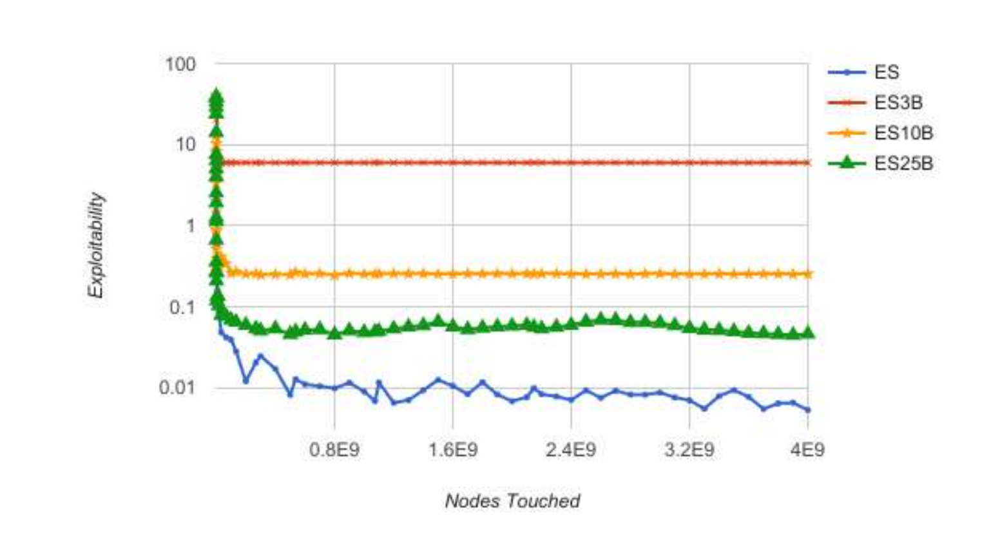
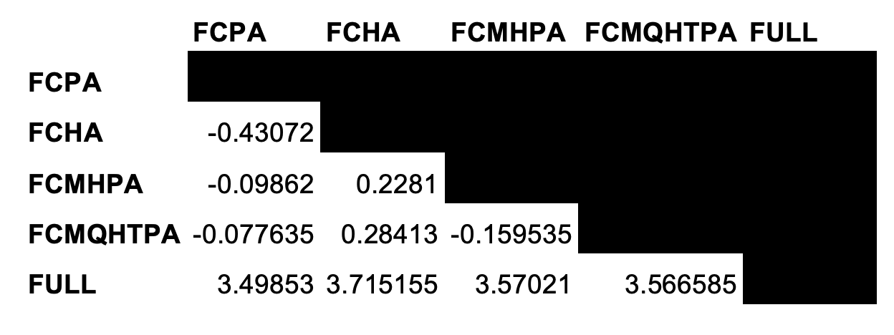

# CFR - Game Abstractions
Abstraction is the main method for solving incomplete information games that are too
large to be solved in their original form. It is extremely prevalent in solving poker
games. 

## Game Abstraction Techniques
The Abstraction-Solving-Translation model includes the following steps:

First, the game is abstracted to create a smaller game that is strategically similar to the
original game. Then the approximate equilibrium is computed in the abstract game,
and finally the abstract game is mapped back to the original game. The resulting
strategy is a Nash equilibrium approximation in the original game, but will still be
exploitable to some degree since it is only an actual Nash equilibrium in the abstracted smaller game.

We need abstraction when game sizes are too large to be solved with current
technology, or when the original game may be too difficult or large to write in full
details, or when the game may not be composed of discrete actions/states in its
original form.

Strategies for abstract games are defined in the same way as strategies in the main
game, but restricted strategies must be given zero probability, meaning if there was a betting abstraction to use only check, bet 1/2 pot, and bet full pot, in a situation where the pot is $100, only checking, betting $50, and betting $100 would be possible, while all other options would be given zero probability. 

## Types of Abstractions
The two main ways to create a smaller game from a larger one in poker are to merge
information sets together (card abstraction) and to restrict the actions a player can take
from a history (action abstraction). These techniques are often combined.

A further possibility is to simplify the game itself. This can be done in poker by
limiting the maximum number of bets per round, eliminating betting rounds, and
eliminating cards. For example, the variant of Texas Hold’em that we analyze with betting abstractions below is called Royal Texas Hold’em and uses only 20 cards instead of the standard
52 in the deck.

Abstractions can be either lossless or lossy. A lossless abstraction respects the original
strategic complexity of the game, while reducing the number of game states. 

### Lossless Abstraction and Isomorphisms
With poker, the first step is usually to use lossless abstraction to take advantage of the
strategic equivalence of poker hands with regards to their suits. All suits are of the
same value, so only how many cards of the same suit a player has is relevant, not the
actual type of suit. For example, a player with a starting hand of Jack of spades and
Queen of hearts has the same exact quality hand in the case of having Jack of
diamonds and Queen of clubs. There are 16 combinations of a Queen and Jack. The
12 that are different suits can be reduced to only one abstracted strategy and the four of
the same suit are also equivalent to one abstracted strategy. Such abstractions
generally reduce the size of poker games by one to two orders of magnitude. Lossless abstraction enabled the solution of Rhode Island Hold’em (by Gilpin and Sandhol from CMU in the mid 2000s), an AI challenge problem with 3.1 billion nodes in the game tree, but generally, lossy abstraction is
also needed.

This lossless abstraction must be redefined at each betting round, because while the
type of suits are not relevant on a per-round basis, future rounds can redefine the
value of a hand according to its suits. Continuing the above example, after a flop of
6h7h8h, the QhJs hand is much superior to the QcJd hand due to now having four
hearts (one heart away from a flush).

In a Texas Hold’em game, just from the first round alone, we move from 52c2*50c2 = 1,624,350 to 28,561 combinations by using lossless abstraction. 

Kevin Waugh showed a [fast and optimal technique](http://www.cs.cmu.edu/~./kwaugh/publications/isomorphism13.pdf) to index poker hands that
accounts for suit isomorphisms. Isomorphisms are cases where poker hands
cannot be strategically distinguished. Using such techniques, we can build lossless
abstraction. For example, in Royal Hold’em, where there are 20 cards (four suits and
cards Ten, Jack, Queen, King, and Ace), we have the following two-card starting
hands:

- Order and suitedness matter: 20 ∗ 20 = 400 combinations
- Order does not matter, suitedness matters: 20c2 = 190 combinations
- Order and suitedness do not matter: 25 combinations (10 unpaired
combinations both suited and unsuited and 5 pairs)

We can permute the suits and order of the cards within any round however we would
like without losing any strategic significance, so Royal Hold’em effectively begins
with only 25 information sets for the player acting first in the preflop round. According to Waugh's paper, it is
important that we can construct an indexing function that is efficient to compute which is optimal with no holes, has an inverse mapping, and is generalizable to other games.

In practice, we store the regrets and strategies for each index, whereby multiple
equivalent hands can use the same index. The indexing procedure works by indexing
using the multiset-colex index, whereby we first index rank sets (sets of cards of the
same suit), then rank groups (sequences of rank sets), and finally combine them into a
hand index (details in the paper linked above). 

### Lossy Abstraction
All other abstractions are lossy and result in some loss of strategic significance. We
look at experiments with action abstraction in our work with Royal No Limit Hold’em and
with card abstraction in Kuhn Poker.

Action abstraction is when players are given fewer actions available than in the
original game, that is, a restriction on the players’ strategy space. This is especially
useful for games with large numbers of possible actions available, such as NLHE. In
no limit poker, the most standard action abstraction is allowing only {fold, call, pot
bet, allin bet}. This restricts the first action in a no limit hold’em game with $20
starting stacks and a $2 big blind to either {fold, call $2, raise to $4, raise to $20}
instead of {fold, call, raise to any amount between and including $4-$20}, which
results in four total actions possible instead of 19. These types of abstractions are often used when running solver simulations. 

Card, or information, abstraction occurs by grouping categories of hands into
equivalence classes called buckets. The standard method, expected hand strength,
works by grouping by the probability of winning at showdown against a random hand
by enumerating all possible combinations of community cards and finding the portion
of the time the hand wins. For example, one could create five buckets to divide the
probabilities into equities from {0-0.2, 0.2-0.4, 0.4-0.6, 0.6-0.8, 0.8-1}. This could
lead to some buckets being very small and others very large. Hands also must
transition between buckets during play. Buckets could be created automatically such
as in the manner just described or manually, which requires expert input, but would be
quite difficult to create policies for.

There are three main methods to compare abstraction solutions to poker games: one on one (against either another agent or a human), versus equilibrium, and versus best
response. Respectively, the possible problems possible are intransitivities, infeasible
computation, and not being well correlated with best performance. Abstractions can
also be measured based on their ability to estimate the true value of the game. 

### Action Translation
A reverse mapping, also known as action translation, is used to map actions in the
original game, where all actions are possible, to an action in the abstracted model.
This is necessary because opponents can take actions in the full game that have been
removed from the abstracted model. Clever bet sizing can render the most basic
mappings highly exploitable. An intelligent model is needed to handle these
situations. The basic model works by mapping an observed action a of the opponent
to an action a' that exists in the abstracted model, and then responding to the action as
if the opponent had played a'.

Prior to Ganzfriend and Sandholm's solution in 2013 in "[Action Translation in Extensive-Form GAmes with Large Action Spaces: Axioms, Paradoxes, and the Pseudo-Harmonic Mapping](https://www.cs.cmu.edu/~sandholm/reverse%20mapping.ijcai13.pdf)", most mappings were exploitable and based
on heuristics, not theory.

Their model works as follows: 
The opponent bets x, an element of [A, B], where A is the largest betting size in the
abstraction that is ≤ x and B is the smallest betting size in the abstraction that is ≥ x,
assuming 0 ≤ A < B.

The question is where to match (and therefore respond to) the bet x as if it were A or
B. f_{A,B}(x) is the probability that we map x to A with the goal being to minimize exploitability. 

The following basic desiderata properties are given for all action
mappings in poker from the paper:

1. Boundary Constraints: If an opponent bets an action in our abstraction, then x should be matched to
that bet size with probability 1, so f(A) = 1 and f(B) = 0.
2. Monotonicity: The probability mapping to A should decrease as x moves closer to B
3. Scale Invariance: Scaling A, B, and x by some multiplicative factor k > 0 does
not affect the action mapping
4. Action Robustness: Such that f changes smoothly in x, avoiding any sudden
changes that could result in exploitability
5. Boundary Robustness:  Such that f changes smoothly with A and B

There are also properties that are justified based on a small toy game called the clairvoyance game,
found in the book The Mathematics of Poker. The game works as follows:

- Player P2 is given no private cards
- Player P1 is given a single card drawn from a distribution of half winning and half losing hands
- Both players start with n chips
- Both players ante $0.50, so the starting pot is $1
- P1 acts first and can bet any amount from 0 to n
- P2 responds by calling or folding (no raising is allowed and a bet of 0 simply
results in a showdown)

The solution of this game was found to be:
- P1 bets n with probability 1 with a winning hand
- P1 bets n with probability n/(1+n) with a losing hand (otherwise checks, with
probability 1/(1+n))
- P2 calls a bet of size x ∈ [0, n] with probability 1/(1+x)

This motivates the proposed action translation mapping of, which meets the above desiderata and that is consistent with the results of the clairvoyance game:

f_{A,B}(x) * 1/(1+A) + (1-f_{A,B}(x))*1/(1+B) = 1/(1+x)

Which can be solved to find the mapping, called the pseudo harmonic mapping:

f_{A,B}(x) = (B-x)(1+A)/((B-A)(1+x))

This mapping is the only one consistent with player 2 calling a bet size of size x with
probability 1/(1+x) for all x ∈ [A, B].

This mapping exhibited less exploitability than prior mappings in almost all cases,
based on test games such as Leduc Hold’em and Kuhn Poker. In Kuhn Poker, an
interesting phenomenon was discovered – that fitting an action betting abstraction to a
known equilibrium strategy could actually result in the agent being more exploitable.
The optimal bet size was found to vary significantly as different stack sizes and
mappings were used.

This means that the optimal action abstraction to use could vary depending on the
action translation mapping used. It may be important to use action abstractions that
are a combination of optimal offensive actions used by the agent itself and defensive
actions that are used by opponents and are necessary to reduce exploitability. It may
be even better to use game specific information in determining abstraction or to use
different mappings at different information sets.

#### Card Abstraction in Kuhn Poker
For this coding project, we use a verison of Kuhn Poker with deck size of 100 cards, so the game still has the same rules, but the complexity increases as players do not have such simplistic decisions as they would
with a very small deck. Kuhn Poker has only four information sets per card, so it has 12 information sets in
standard form (using 3 distinct cards) and 400 information sets in the 100-card
version. 

We compared these versions of CFR: 
1. Chance Sampling (sampling only chance nodes and then running regular CFR)
2. External Sampling (sampling chance nodes and opponent nodes)
3. Vanilla (regular)
4. CFR+ (regular CFR with a modified regret metric that resets regrets to 0 if they become negative)

For the External and Chance Sampling CFR versions, we tested simple bucketing that
splits the cards into three, 10, and 25 buckets. This means that with 3-bucket
abstraction, each group of hands {0-32, 33-65, 66-99} will share a single strategy.
Essentially each player’s card is hidden to himself and he only knows which bucket
his card is in, although at showdown, each player’s true card would be shown to
determine the winner of the hand. 

The results are shown below. Again, the game values for all
abstractions are -0.0566 except for the 3-bucket abstraction, which is -0.0264,
meaning that the Player 2 advantage is decreased due to the weakness of the
abstraction. Note that ES and CS refer to External Sampling and Chance Sampling
and 3B/10B/25B refer to 3 buckets, 10 buckets, and 25 buckets. 

The figures are quite similar for both algorithms and show that the lower bucket
abstractions converge slightly faster than the 25-bucket abstraction, which is also
faster than the unabstracted exploitability. However, the unabstracted exploitability is
almost immediately less exploitable than the alternatives, rendering them not very
useful, probably because the game is not complex enough. We also see here that the
exploitability values are significantly better as the number of buckets increases,
because with fewer buckets, more hands share the same strategy. 

#### Bet Abstraction in No Limit Royal Hold'em
We look a variation of No Limit Hold'em called Royal No Limit
Hold’em that requires only 7GB of RAM to solve (assuming one byte per info-set to
store the behavioral strategy and two 8-byte doubles per info-set to solve the game
precisely), which means that it can be used as a testbed for anyone to work on,
without requiring access to supercomputers. This game and its use as a testbed was
given as an idea by Michael Johansen in his 2013 paper, “[Measuring the Size of Large No-Limit Poker Games](https://arxiv.org/abs/1302.7008)”. This testbed concept was important because at the time, during the ACPC, a major factor correlating to the quality of the poker agents was
access to powerful supercomputers capable of solving larger game abstractions, which
gives an advantage to those with access to such machines. 

Royal No Limit Hold’em is a simplified version of No Limit Texas Hold’em. We will
study the game with 2 players, blinds of \\$1 (small blind) and \\$2 (big blind), and
starting stacks of \\$20 per player, which reset after each hand. Instead of a standard 52
card deck, the Royal game means that we discard cards 2 through 9 and use only the
Ten, Jack, Queen, King, and Ace, hence the name Royal. Royal Hold’em has only
two betting rounds, not four as in standard Texas Hold’em. There is the preflop round
and then after the flop (the first three community cards) betting round, the Royal
Hold’em game ends. No limit betting is the same as in Texas Hold’em – no maximum
number of bets per round and the minimum bet is the big blind or the prior bet/raise
size, whichever is larger. The maximum bet size is the amount of chips in front of
each player.

The strength of hands in Royal Hold'em is, in order from best to worst: Royal flush (the only flush possible), Four of a kind, Full house, Straight, Three of a kind, Two pair, One pair (worse hands are not possible). In normal poker, a hand without pairs would be possible and also other flushes would be possible. 

Royal No Limit Hold'em has on the order of 10^8 information sets, compared to the full No Limit Hold'em game on the order of 10^161 information sets. 

The purpose of experimenting with action abstractions in Royal No Limit Hold’em is
to understand which abstractions are most efficient, and since Royal Hold’em has
many features in common with Texas Hold’em, it is hoped that these abstraction
features could be transferred to researchers studying Texas Hold’em or other incomplete
information games.

The experiment was run using the ACPC standard protocol and a version of CFR called Pure CFR created by Richard Gibson of the University of Alberta and Kevin Waugh's card isomorphism open source code. Pure CFR is a version of CFR that samples pure strategy profiles (exactly one action
assigned probability 1 at each state) for each iteration, using no sampling. Pure CFR
has been shown to work faster than Vanilla CFR and also is memory efficient by
using only integer values and not doubles, which is made possible by the pure strategy
profiles and the fact that pot sizes and bets in poker are all integer valued. 

We tested solving the full game and also the game with these action abstractions: 

1. Fold, call, pot, allin (FCPA)
2. Fold, call, half pot, allin (FCHA)
3. Fold, call, minimum, half pot, pot, allin (FCMHPA)
4. Fold, call, minimum, half pot, three-quarters pot, pot, allin (FCMHQTPA)

Since the full game can be solved completely, this enables us to compare our
abstracted solutions against the full game solution, otherwise not possible in standard
poker games due to the size of the full game.

Each abstraction and the main game were run for 12 hours over four threads on a 2.6
GHz Intel Core i7 computer with 16 GB of RAM. Since there was not a best response
algorithm used in this experiment, the abstractions were run for shorter periods and
then tested and then continued for longer periods until it seemed that the strategies
had converged, based on the match result changes. The sizes of the strategies of the
abstractions from smallest to largest were 5.5 MB, 10.2 MB, 160 MB, and 471 MB.
The full game solution is 3.58 GB. 

We compare our abstractions in two ways:

1. Against main game equilibrium: Each of the four abstracted solutions plays
against the main game solution in the main game
2. Against each other: Each of the four abstracted solutions plays against each
other in the main game

After solving the game in the abstracted action space, we must allow for the
abstracted player solution to play in the original game, where all actions are allowed. 

This requires the use of action translation. As described above, the following
translation has been shown to be less exploitable than other options:

f_{A,B}(x) = (B-x)(1+A)/((B-A)(1+x))

Matches between all combinations of the four abstractions and the full game were
played over 10,000,000 hands each in duplicate, so 5,000,000 were played once and
then the same 5,000,000 were played again with the hands swapped to reduce
variance. 

The following table lists the results from the perspective of the row abstraction in
terms of big blinds per 100 hands (i.e., the number of $2 amounts won per 100
hands):

We see that the full agent dominates all abstracted agents, as expected. FCPA is
slightly superior to the other agents against the full agent. FCPA also beats all of the
other abstracted agents, which may be due to the more sophisticated ones becoming
overfit to their abstracted games. FCHA loses to all abstractions, possibly because the
half pot and all-in bets results in too wide of a range between the two actions.

Unfortunately, the relatively small size of the game, intended to provide access to
individuals without access to supercomputers, results in the abstracted agents for the
first player strategy in the preflop round to virtually always only call the big blind or
to go allin. While the full game agent plays a more mixed strategy that involves
raising to a variety of sizes, a large amount of these raises are near-all-in amounts,
that are strategically essentially equivalent to an all-in bet (e.g., raising to 18 out of 20
chips on the first action). 

Waugh et al’s [work on abstraction pathologies](https://poker.cs.ualberta.ca/publications/AAMAS09-abstraction.pdf) shows
that despite finer abstractions tending to perform better and better each year in the
ACPC, these abstractions do not guarantee better results. However, they do show that
if the opponent is playing the full game, that the opponents should be monotonically
improving as their abstractions grow larger, which we did not see in these results,
although the winrates are within only about 2% between the different abstractions.
They showed that in abstraction vs. abstraction matches, monotonicity often does not
hold, and agents could even become more exploitable. A theory is that providing additional strategies to a player can encourage the
player to exploit the limitations of the opponent’s abstraction, resulting in a strategy
that is more exploitable by actions that become available to the opponent in the full
game.

While these results show evidence of FCPA being the best abstraction amongst these
choices -- it may be necessary to run this experiment on a larger testbed game that may not be solvable
on personal computers, but also does not require very specialized equipment. 

## Game Size
The size of a game is a simple heuristic that can be used to describe its complexity
and to compare it to other games. One way to measure a game size is to count the
number of game states, the number of possible sequences of actions by the players or
by chance, as viewed by a third party that observes all of the players’ actions. In
poker, this is all of the ways that the players’ private and public cards can be dealt and
all of the possible betting sequences.

Infoset-actions is the standard game size measurement in poker, which is the number
of legal actions summed over each information set, also known as the total number of
behavioral strategies. An spectator’s (who cannot see private cards) view of the
number of infoset-actions is considered the two-sided perspective. The one-sided
perspective is the number of infoset-actions from the perspective of one player. This
can be further reduced to the one-sided canonical perspective, which is the same as
the one-sided, but also includes losslessly merging isomorphic card combinations that
are strategically identical.

CFR converges linearly with the number of canonical information sets. The algorithm
requires two double-precision floating point variables per infoset-action, one to
accumulate regret, and the other to accumulate the average strategy.
Michael Johanson of the University of Alberta showed that the sizes of games can generally be compared by means of
evaluating the number of game states, or the number of possible sequences of actions
by the players or by chances. In poker, this includes all the ways that the public and
private cards can be dealt and all possible betting sequences. 

### Limit Hold'em Size
In limit hold’em, the task of computing the number of infoset-actions is relatively
easy because there is only one betting option allowed for each betting round, which
can only occur a maximum of four times, and the betting actions and information sets
within each round are independent of the betting history and stack sizes (assuming
large enough stack sizes to be able to complete all bets). From a 1-player perspective
(assuming the 2nd player’s cards are unknown), the number of ways to deal the cards
is calculated as:

52c2 for the 1st round and then 52c2 * 50c3 for the 2nd round, and so on

These calculations would be reduced if we considered lossless abstraction of card
combinations.

We can calculate the number of information sets by looking at each round and
multiplying the card combinations in that round by the possible betting sequences
based on a chart of betting sequences. 

### No Limit Hold'em Size
No-limit poker is more of a computational challenge because each betting round
depends on prior rounds, since each player’s stack size varies as the hand progresses.
Each game depends on two variables: the stack size to start the game and the value of
the big blind. 

Per the game rules, players have the following two betting restrictions:
Minimum bet: max(big blind, current bet size)
Maximum bet: Stack size

The legal actions possible depend on three factors: amount of money remaining,
size of bet facing, and if it’s possible to check (if it’s the first action in a round). 

Each
of these factors strictly increases or decreases in a round.
The method used to compute the number of infoset-actions in no limit hold’em poker
is to incrementally compute the number of action histories that reach each of these
configurations by using dynamic programming. The base case is the start of the
game and the inductive step is n action sequences reach a given configuration, then
for each legal action at that configuration, we can add another n ways to reach
subsequent configurations. We look at each round in increasing order, visit all  configurations where checking is allowed, and then where a call ends the round. We
update each configuration in order from largest stacks remaining to smallest and
within each subset from smallest bets faced to largest. 

This requires only a single
traversal since all actions taken from a configuration only update the number of ways
to reach configurations later in the ordering. Counters are used for each round that
track the number of action sequences that lead to a decision by a player and the total
number of infoset-actions. The algorithm traverses configurations over all rounds,
then multiplies by the branching factors due to chance events.

The implementation involves one variable for each configuration of stack size and bet
faced, which can be done with a 2-dimensional array, which can be reused each round
with the addition of a vector indexed by stack size to track possible ways to reach the
next round.

Michael Johanson’s paper performs these calculations for the standard No Limit Texas
Hold’em game used in the ACPC, which uses \\$20,000 (200-blind) stacks with \\$50-
\\$100 blinds. Although 200 blinds is fairly normal in poker (although most online
games start with 100 blinds), the large stack size in absolute dollar terms means that a
much larger number of actions are possible than, for example, 200 blinds in a \\$1-\\$2
blind setting. The initial raise in the latter setting is any amount from \\$4 to \\$400,
whereas in the former it is \\$200 to \\$20,000. 

### Comparing Limit and No Limit Hold'em
Whereas limit hold’em has a 1-sided canonical game size of 1.4x10^13 infosetactions, no limit $1-2 with $1000 starting stacks (500 blinds) is 3.12x10^71, $1-2
with $400 (200 blind) starting stacks is 6.0x10^46, and $50-100 with $20,000 (200
blind) starting stacks is 2.8x10^160. Not including transpositions, chess has 10^47
game states, checkers has 10^20 game states, and Go has 10^170 states.

Although one vs. one limit hold’em has now been solved over a long computation
period with a very specialized parallel machine setup, no limit is substantially larger
and requires abstraction to make the game small enough to be solved. Johanson
recommends analyzing the suboptimality in unabstracted games by finding a game
with these 3 properties: 

1. Unabstracted best response computations are tractable and convenient, so
worst case performance of strategies with abstracted betting can be evaluated.
One can then evaluate abstraction and translation techniques in isolation from
other factors.

2. Unabstracted equilibrium computations are tractable and convenient. So we
can compute an optimal strategy for the game and measure its performance
against agents that use betting abstraction.

3. Strategic elements similar to those of NLHE (in terms of rounds, deck size, 5-
card poker hands, and large stack sizes)

Properties (1) and (2) allow for us to compare agents in the full game and in terms of
(1) best response and (2) against the full game equilibrium. For condition (3), in order
to provide the flexibility of solving this game on standard personal computers, we are
limited in the size of the game that we can possibly use. 

### Royal No Limit Hold'em 
Johanson suggests a potential testbed game as 2-\\$20 \\$1-\\$2 No Limit Royal Hold’em,
a game which uses 2 betting rounds, \\$20 stack sizes, and \\$1-\\$2 blinds. The game size
is 1.55x10! and CFR requires 7GB of RAM for the computation.

While the size of full poker games that are commonly played in casinos require more
memory than is feasible for today’s modern computers, Royal No Limit Hold’em is
accessible to all, which could make a game of this sort a more even playing field in a
competition.

We analyzed betting abstractions in Royal Hold'em to determine whether basic abstractions like FCPA (fold, call,
pot, allin) are exploitable and can be improved by more sophisticated abstractions. We
also wanted to test whether the weaker the abstraction, the more exploitable it will be and the
higher the losses against the unabstracted agent. 

With more advanced CFR versions that use deep learning rather than only tabular data like the original CFR, it's likely that a much larger testbed game could be explored. 

