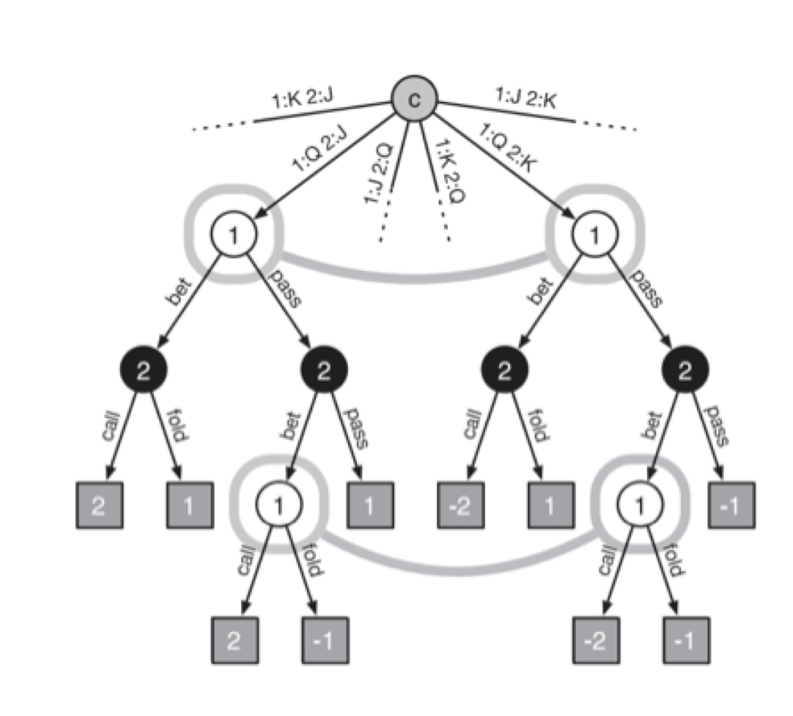
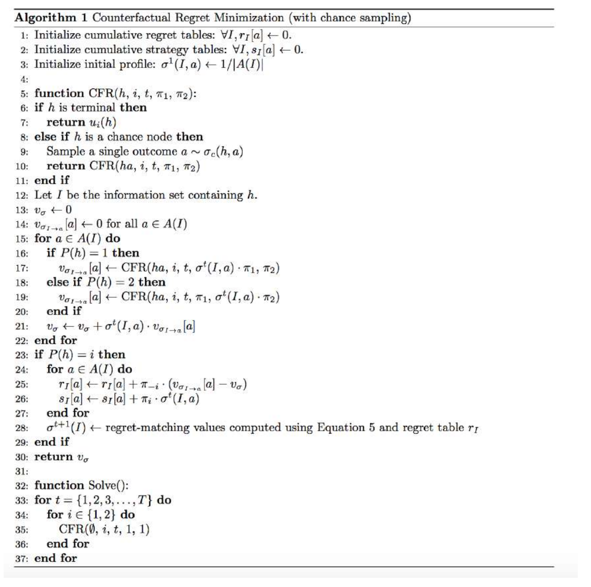
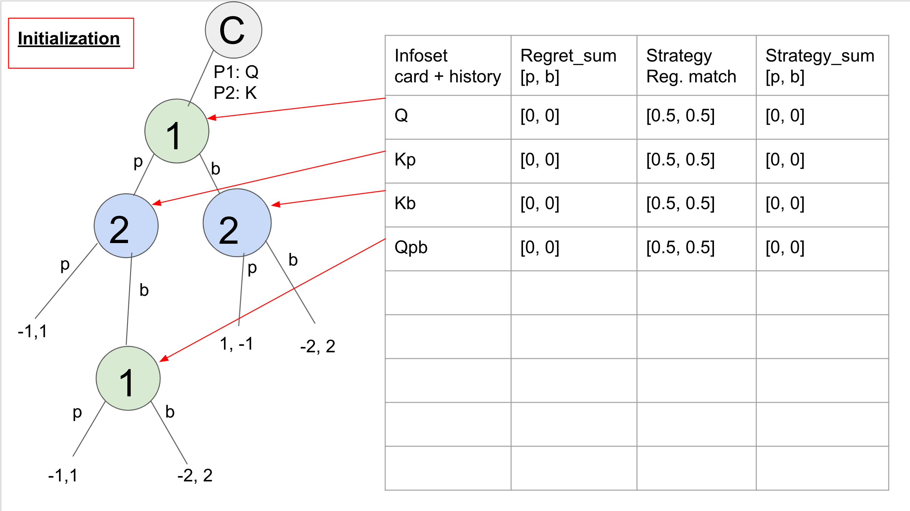
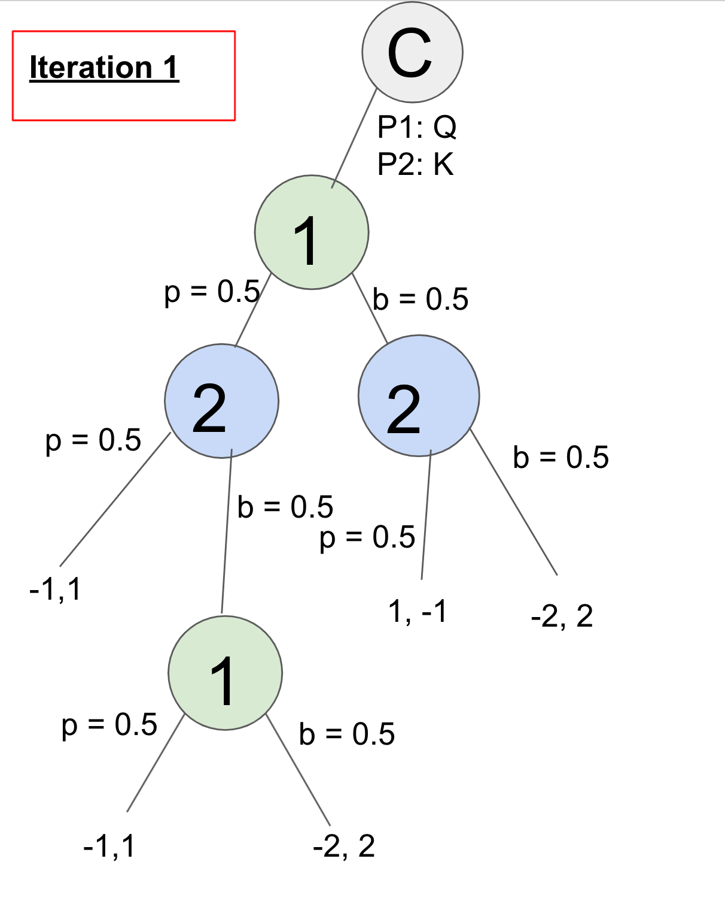
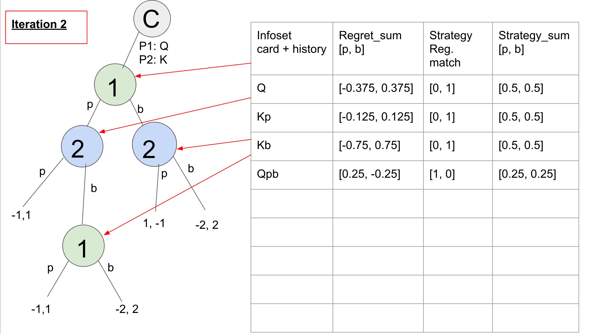
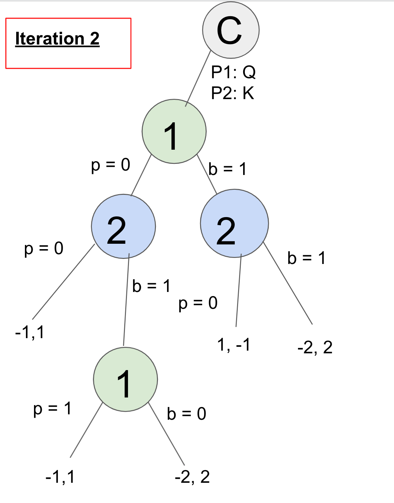
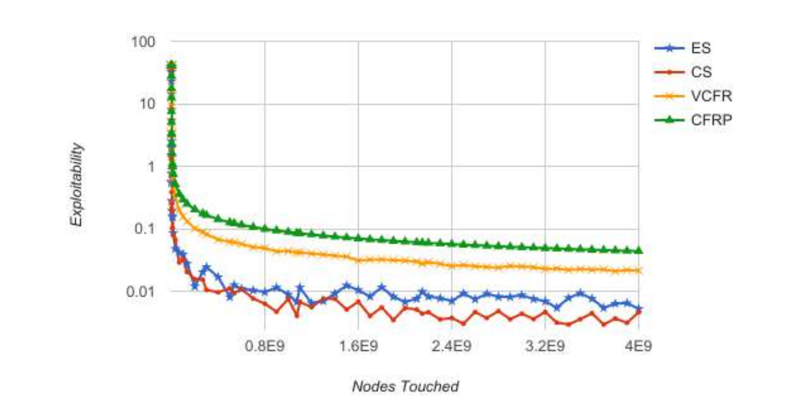
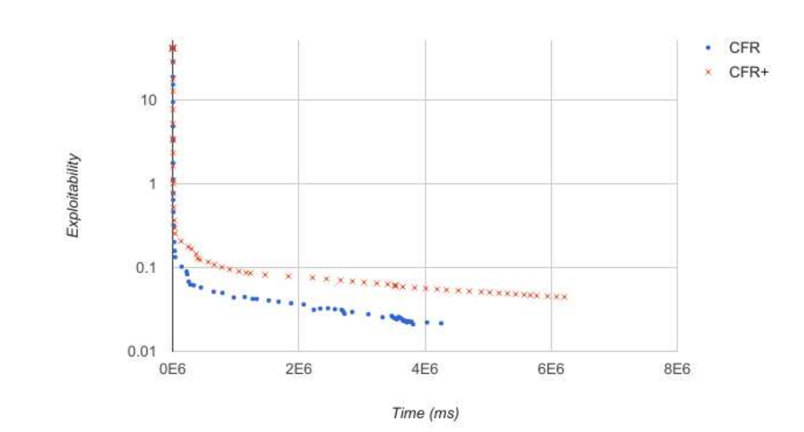

<!-- 
TODO: 
1) Review my thesis
2) Iteration automation/visualization, maybe with Winston (what about interpretabilitu)
3) Coding simple both with (a) basic input, (b) response to opponent, (c) CFR, (d) advanced CFR
4) Minimization explanation
5) https://pypi.org/project/PokerRL/, https://xscode.com/tansey/pycfr, https://github.com/tansey/pycfr, https://rlcard.org/index.html, https://github.com/datamllab/rlcard, https://towardsdatascience.com/rlcard-building-your-own-poker-ai-in-3-steps-398aa864a0db, https://github.com/paul-chelarescu/counterfactual-regret-minimization, https://github.com/DabeLong/Two-Card-Poker-CFR-AI/blob/master/cfr.py, https://github.com/int8?tab=repositories 
-->

# CFR - The CFR Algorithm 
The Counterfactual Regret Minimization (CFR) algorithm was first published in a 2007 paper from the University of Alberta by Martin Zinkevich et al. called "[Regret Minimization in Games with Incomplete Information](https://poker.cs.ualberta.ca/publications/NIPS07-cfr.pdf)". Counterfactual means "relating to or expressing what has not happened or is not the case".

## TLDR Explanation
CFR is a self play algorithm that learns by playing against itself repeatedly. It starts play with a uniform random strategy (each action at each decision point is equally likely) and iterates on these strategies to nudge closer to the game theory optimal Nash equilibrium strategy as the self play continues. The Nash equilibrium strategy is a "defensive" strategy that can't be beaten, but also doesn't take advantage of opponents. The counterfactual part comes from computing values based on assuming that our opponent plays to certain game states.



At each information set in the game tree, the algorithm keeps a counter of regret values for each possible action. The regret means how much better the agent would have done if it had always played that action rather than the actual strategy that could be a mixture of actions. Positive regret means we should have taken that action more and negative regret means we would have done better by not taking that action. 

The values computed with the regret are called counterfactual values, which are the value of playing an action at a certain game state weighted by the probability (counterfactual assumption) of the other agent playing to that game state. 

For example, if the agent was playing a game in which it had 5 action options at a certain game state and Action 1 had a value of 3 while the game state average over all 5 actions was 1, then the regret would be 3-1 = 2. This means that Action 1 was better than average and we should favor taking that action more. 

The CFR algorithm updates the strategy after each iteration to play in proportion to the regrets, meaning that if an action did well in the past, the agent would be more likely to play it in the future. 

The final Nash equilibrium strategy is the average strategy over each iteration. This strategy cannot lose in expectation and is considered optimal since it's theoretically robust and neither player would have incentive to change strategies if both playing an equilibrium. This is what we mean when we say "solve" a poker game. 

## Detailed Intuitive Explanation
Michael Johanson, one of the authors on the original paper, gave his intuitive explanation of CFR in a [post on Quora](https://www.quora.com/What-is-an-intuitive-explanation-of-counterfactual-regret-minimization). 


## The Algorithm
Due to the constraints of solving imperfect information games with MCTS and the memory limits of solving games with linear programs, CFR was developed as a novel solution. CFR also benefits from being computationally cheap and doesn’t require parameter tuning. It is an iterative Nash equilibrium approximation method that works through the process of repeated self-play between two regret minimizing agents.

CFR is an extension of regret minimization into sequential games, where players play a sequence of actions to reach a terminal game state. Instead of storing and minimizing regret for the exponential number of strategies, CFR stores and minimizes a regret for each information set and its actions, which can be used to form an upper bound on the regret for any deterministic strategy. This means that we must also consider the probabilities of reaching each information set given the players’ strategies, as well as passing forward game state information and probabilities of
player actions, and passing backward utility information through the game information states. The algorithm stores a strategy and regret value for each action at each node, such that the space requirement is on the order O(|I|), where |I| is the number of information sets in the game.

CFR is an offline self-play algorithm, as it learns to play by repeatedly playing against itself. It begins with a strategy that is completely uniformly random and adjusts the strategy each iteration using regret matching such that the strategy at each node is proportional to the regrets for each action. The regrets are, as explained previously, measures of how the current strategy would have performed compared to a fixed strategy of always taking one particular action. Positive regret means that we would have done better by taking that action more often and negative regret means that we would have done better by not taking that action at all. The average strategy is then shown to approach a Nash equilibrium in the long run.

In the vanilla CFR algorithm, each iteration involves passing through every node in the extensive form of the game. Each pass evaluates strategies for both players by using regret matching, based on the prior cumulative regrets at each player’s information sets. Before looking at the CFR equations, we will refresh some definitions that were given in previous sections here when they
are relevant to the forthcoming equations.

Let A denote the set of all game actions. We refer to a strategy profile that excludes
player i’s strategy as sigma_(-i). A history h is a sequence of actions, including chance
outcomes, starting from the root of the game. Let pi^(sigma)(h) be the reach probability of
game history h with strategy profile sigma and pi^sigma(h,z) be the reach probability that
begins at h and ends at z. 

Let Z denote the set of all terminal game histories and then we have h ⊏ z for z ∈ Z is
a nonterminal game history. Let u_i(z) denote the utility to player i of terminal history
z.

We can now define the counterfactual value at nonterminal history h as follows:
v_i(sigma, h) = sum (z in Z),h ⊏ z of pi^sigma_(-i) * pi^sigma(h,z) * u_i(z)

This is the expected utility to player i of reaching nonterminal history h and taking
action a under the counterfactual assumption that player i takes actions to do so, but
otherwise player i and all other players follow the strategy profile sigma.

The counterfactual value takes a player’s strategy and history and returns a value that
is the product of the reach probability of the opponent (and chance) to arrive to that history and the
expected value of the player for all possible terminal histories from that point. This is
counterfactual because we ignore the probabilities that factually came into player i’s
play to reach position h, which means that he is not biasing his future strategy with his
current strategy. This weights the regrets by how often nature (factors outside the
player’s control, including chance and opponents) reach this information state. This is intuitive because states that are more frequently played to by opponents are more important to play profitably. 

An information set is a group of histories that a player cannot distinguish between.
Let I denote an information set and let A(I) denote the set of legal actions for
information set I. Let sigma_(I-->a) denote a profile equivalent to sigma, except that action a is
always chosen at information set I. The counterfactual regret of not taking action a at
history h is defined as:

r(h,a) = v_i(sigma_(i-->a),h) - v_i(sigma, h)

This is the difference between the value when always selecting action a at the history
node and the value of the history node itself (which will be defined in more detail shortly). 

Let pi^sigma(I) be the probability of reaching information set I through all possible game
histories in I. Therefore we have that pi^sigma(I) = sum h∈I pi^sigma(h). The counterfactual reach
probability of information state I, p^sigma_(-i)(I), is the probability of reaching I with strategy
profile sigma except that, we treat current player I actions to reach the state as having probability 1. 

The counterfactual regret of not taking action a at information set I is:
r(I,a) = sum h∈I r(h,a)

This calculation simply includes all histories in the information set.

Let t and T denote time steps, where t is with respect to each fixed information set and
is incremented with each visit to an information set. A strategy sigma^t_i for player i maps
each player i information set I_i and legal player i action a∈A(I_i) to the probability
that the player will choose a in I_i at time t. All player strategies together at time t form
a strategy profile sigma^t, to be detailed shortly.

If we define r^t_i(I,a) as the regret when players use sigma_t of not taking action a at
information set I belonging to player i, then we can define the cumulative
counterfactual regret as follows, which is the summation over all time steps:

R^T_i(I,a) = sum t=1 to T r^t_i(I,a)

In recent years, researchers have redefined the counterfactual value in terms of
information sets. This formulation shows the counterfactual value for a particular
information set and action, given a player and his strategy:

v^sigma_i(I,a) = sum h∈I sum z∈Z: h⊏z u_i(z)pi^sigma_(-i)(z)pi^sigma:I-->a _i(h,z)

We see that this is similar to the first equation for the counterfactual value, but has some differences. Because we are now
calculating the value for an information set, we must sum over all of the relevant
histories. The inner summation adds all possible leaf nodes that can be reached from
the current history (same as the original one) and the outer summation adds all histories that are
part of the current information set.

From left to right, the three terms on the right hand side represent the main player’s
utility at the leaf node z, the opponent and chance combined reach probability for the
leaf node z, and the reach probability of the main player to go from the current history
to the leaf node z, while always taking action a. The differences between this
formulation and that of the original equation will be reconciled with the next equation. 

The counterfactual regret of player i for action a at information set I can be written as
follows:

R^T_i(I,a) = sum t=1,T v^sigma^t _i(I,a) - sum t=1,T sum a'∈A v^sigma^T _i (I,a')sigma^t_i(a'\\|I)

This formulation combines the three equations, where one had introduced the
cumulative summation, one added all histories in the information set, and one
defined the counterfactual regret difference equation. The first part of the difference
in the counterfactual regret equation computes this value for the given a value, while the second part computes
the expected value of all other a value options at the information set.

The inner summation of this part of the equation is over all non-a strategies and the outer
summation is over all times. The first term in the summations computes the
counterfactual value for each non-a strategy and the second term multiplies the
counterfactual value by the player’s probability of playing that particular strategy at
the given information set.

We can show the regret-matching algorithm by first defining the nonnegative
counterfactual regret as R^T,+ _i (I,a) = max(R^T _i(I,a),0). Now we can use the cumulative regrets to obtain the strategy decision for the next iteration using reget matching: 

Case 1 when sum a'∈A R^(t-1) _i (I,a'))^+ > 0 then sigma^t _i(a\\|I) = (R^(t-1) _i (i,a))^+ / (sum a'∈A R^(t-1) _i (I,a'))^+)

Case 2 otherwise then sigma^t _i(a\\|I) = 1/\\| A \\|

This regret matching formula calculates the action probabilities for each action at each
information set in proportion to the positive cumulative regrets. First we check to see
if the cumulative regrets at the previous time step are positive. If not, the strategy is
set to be uniformly random, determined by the number of available actions. If it is,
then the strategy is the ratio of the cumulative regret of the defined action over the
sum of the cumulative regrets of all other actions. 

The CFR algorithm works by taking these action probabilities and then producing the
next state in the game and computing the utilities of each action recursively. Regrets
are computed from the returned values and the value of playing to the current node is
then computed and returned. Regrets are updated at the end of each iteration. 

## Regret Bounds and Convergence Rates
CFR has been shown to eliminate all dominated strategies from its final average
strategy solution.

By following regret matching, the following bound, showing that the counterfactual
regret at each information set grows sublinearly with the number of iterations, is
guaranteed, given that delta = maximum difference in leaf node utilities (|u_i(z) −
u_i(z')| ≤ delta for all i ∈ N and z,z' ∈ Z), A = number of actions, T = iteration number.

R^T _i_infoset(I,a) <= delta * sqrt(\\| A \\|*T)

With a specific set of strategy profiles, we can define a player’s overall regret as:
R^T _i_overall = max sigma_i ∈ sum i (sum t=1 to T u_i(sigma_i, sigma^T _-i)) - sum t=1 to T u_i(sigma)

This is the amount of extra utility that player i could have achieved in expectation if
he had chosen the best fixed strategy in hindsight. Assuming perfect recall, this can be
bounded by the per information set counterfactual regrets of CFR:

R^T _i_overall <= sum I∈I_i max a∈A R^T _i_infoset(I,a) <= \\|I_i\\|*delta*sqrt(\\|A\\|*T)

The fact that minimizing regret at each information set results in minimizing overall
regret is a key insight for why CFR works and since CFR indeed achieves sublinear
regret, this means that it is a regret minimizing algorithm.

In a two-player zero-sum game with perfect recall, for R^t _i ≤ ε for all players, then
the average strategy profile is known to be a 2ε Nash equilibrium. We can therefore
use the regret minimizing properties of CFR to solve games like poker by computing
average strategies as follows:


sigmahat(a|I) = [sum t=1,T (sum h∈I pi^sigma^t _i (h))*sigma^t(a|I)] / [sum t=1,T (sum h∈I pi^sigma^t _i (h)))]

where sum t=1,T (sum h∈I pi^sigma^t _i (h))) is each player's contribution to the probability of reaching a history in information set I, and is therefore the weighting term on sigma^T _i. 

The strategies are combined such that they select an action at an information set in proportion to that
strategy’s probability of playing to reach that information set. We run the CFR
algorithm for a sufficient number of iterations in order to reduce the ε sufficiently.

In the end, it is the average strategy profile that converges to Nash equilibrium.
The best available guarantees for CFR require ~1/ε^2 iterations over the game tree to reach an ε-equilibrium, that is, strategies for players such that no player can be exploited by more than ε by any strategy. 

The gradient-based algorithms, which
match the optimal number of iterations needed, require only ~1/ε or ~log (1/ε)
iterations. However, due to effective CFR sampling methods, quick approximate
iterations can be used such that sampling CFR is still the preferred solution
method.

<!-- Counterfactual value of player i taking action a at information set I: 
$$ v_i^\sigma{}(I,a) = \sum{\sum{u_i(z)\pi_{-i}^\sigma{}(z)pi_i^{\sigma{}:I->a}(h,z)} $$ -->

<!-- In words, this is the expected utility to player i of reaching information set I and taking action a, under the counterfactual assumption that player i takes actions to do so, but otherwise player i and all other players follow the strategy profile $$ \sigma{} $$ -->


### Why average strategy?
A good intuitive way to think about why at the end of running CFR, the average strategy is the Nash equilibrium rather than the final strategy being Nash equilibrium comes from looking at rock paper scissors. 

Suppose that our opponent is playing Rock too much, then CFR moves us towards playing 100% paper (moving towards the best response to their strategy, i.e. the goal of regret minimization). The current strategy can be mixed (and it starts off uniform random), but it gets updated to maximize exploiting opponents and tends to cycle between pure-ish strategies (assuming that we are playing against a real opponent and not using self-play). 

So the algorithm moves us to 100% paper and then the opponent might move to 100% scissors and then we move to 100% rock, and so on! While the current strategy is making sharp bounces around the strategy space without stopping at equilibrium, the average strategy cycles in closer and closer to converging at equilibrium, which in rock paper scissors is playing each action a third of the time. Intuitively it makes sense that the average strategy would be more robust than just taking the final strategy, which could be at a strange point that clearly wouldn't be an equilibrium. 

That said, recent research teams have simply used the final strategy after many many iterations and have had good results, which saves a lot of memory and computation since all of the strategies throughout don't need to be stored and averaged. 
 
<!-- 
### Definitions
Let A denote the set of all game actions. We refer to a strategy profile that excludes
player i’s strategy as $$\sigma_{-i}$$. A history $$h$$ is a sequence of actions, including chance outcomes, starting from the root of the game. Let $$\pi^\sigma(h)$$ be the reach probability of game history $h$ with strategy profile $$\sigma$$ and $$\pi^\sigma(h,z)$$ be the reach probability that begins at $$h$$ and ends at $$z$$. 

Let Z denote the set of all terminal game histories and then we have $$h \sqsubset z$$ for $$z \in Z$$ is a nonterminal game history. Let $$u_i(z)$$ denote the utility to player $$i$$ of terminal history $$z$$. 

We can now define the counterfactual value at nonterminal history $$h$$ as follows: 

$$ v_i(\sigma, h) \equiv \sum{u_i(z)\pi_{-i}^\sigma{}(z)pi_i^{\sigma{}:I->a}(h,z) $$ -->

### Vanilla CFR
Vanilla CFR is the default CFR method where each pass is a full iteration of the game tree. This has been used less ever since the Monte Carlo sampling CFR methods began from Marc Lanctot's research. Although sampling means a larger number of iterations are needed to
reach near equilibrium levels, each iteration is generally much faster and overall
calculation time is generally significantly reduced since regrets are updated very
quickly, instead of only after every long iteration as is the case with vanilla CFR. Vanilla CFR works by passing forward probabilities and game states and passing back utility values and can solve games as large as about 10^12 game states. 

### Monte Carlo CFR (MCCFR)
In Monte Carlo CFR, some sampling method is used to sample to terminal state(s) of the game and then updates are applied only to the sample and not the full tree. Other than that, the updates occur the same way as they do in the standard algorithm. 

The benefit of Monte Carlo CFR is that it uses sampling to make quicker updates to the game tree, even though these updates may be noisy, in practice they are much faster than the precise and slow updates of the vanilla implementation. Memory requirements remain the same as in vanilla CFR since the same information is being stored. 

In practice, this means updating the counterfactual value equation with a 1/q(z) factor to define the probability of sampling a particular terminal history z. Also the summation is defined only for the information set when z is in the sample and passes through the information set I on the way to z. It can be shown that the sampled counterfactual values are equivalent in expectation to the vanilla version, meaning that MCCFR also will be guaranteed to converge to a Nash equilibrium. 

An issue arises with sampling that when taking the average strategy, all nodes may
not have been sampled equal times. This can be addressed in two ways, each of which
has its own disadvantages:
1. Optimistic	averaging:	A	counter	is	placed	at	each	node	and	updates	are	
weighted	by	the	last	time	they	were seen	at	this	node,	which	requires	
extra	memory,	is	only	an	approximation,	and	requires	a	final	iteration	
since	some	counters	will	be	outdated.	
2. Stochastically	weighted	averaging:	Increase	the	magnitude	of	each	
strategy	by	sampling	the	strategy profile	probability.	This	is	unbiased,	but	
results	in	large	variance.	

We touch on two of the most common sampling methods below, called external sampling and chance sampling. Outcome sampling is another method that is the most extreme possible sampling -- it samples one action down the whole tree. 

#### External Sampling
External Sampling entails sampling the actions of the opponent and of chance only.
This means that these samples are based on how likely the opponent’s plays are to
occur, which is sensible, since then regret values corresponding to these plays are
updated faster. We go into this in more detail in Section 4.4 regarding Deep CFR, but provide code here in Python for Kuhn Poker and Leduc Poker. 

Kuhn External CFR code: 

```python
import numpy as np
import random

class Node:
	def __init__(self, num_actions):
		self.regret_sum = np.zeros(num_actions)
		self.strategy = np.zeros(num_actions)
		self.strategy_sum = np.zeros(num_actions)
		self.num_actions = num_actions

	def get_strategy(self):
		normalizing_sum = 0
		for a in range(self.num_actions):
			if self.regret_sum[a] > 0:
				self.strategy[a] = self.regret_sum[a]
			else:
				self.strategy[a] = 0
			normalizing_sum += self.strategy[a]

		for a in range(self.num_actions):
			if normalizing_sum > 0:
				self.strategy[a] /= normalizing_sum
			else:
				self.strategy[a] = 1.0/self.num_actions

		return self.strategy

	def get_average_strategy(self):
		avg_strategy = np.zeros(self.num_actions)
		normalizing_sum = 0
		
		for a in range(self.num_actions):
			normalizing_sum += self.strategy_sum[a]
		for a in range(self.num_actions):
			if normalizing_sum > 0:
				avg_strategy[a] = self.strategy_sum[a] / normalizing_sum
			else:
				avg_strategy[a] = 1.0 / self.num_actions
		
		return avg_strategy

class KuhnCFR:
	def __init__(self, iterations, decksize):
		self.nbets = 2
		self.iterations = iterations
		self.decksize = decksize
		self.cards = np.arange(decksize)
		self.bet_options = 2
		self.nodes = {}

	def cfr_iterations_external(self):
		util = np.zeros(2)
		for t in range(1, self.iterations + 1): 
			for i in range(2):
				random.shuffle(self.cards)
				util[i] += self.external_cfr(self.cards[:2], [], 2, 0, i, t)
				print(i, util[i])
		print('Average game value: {}'.format(util[0]/(self.iterations)))
		for i in sorted(self.nodes):
			print(i, self.nodes[i].get_average_strategy())

	def external_cfr(self, cards, history, pot, nodes_touched, traversing_player, t):
		print('THIS IS ITERATION', t)
		print(cards, history, pot)
		plays = len(history)
		acting_player = plays % 2
		opponent_player = 1 - acting_player
		if plays >= 2:
			if history[-1] == 0 and history[-2] == 1: #bet fold
				if acting_player == traversing_player:
					return 1
				else:
					return -1
			if (history[-1] == 0 and history[-2] == 0) or (history[-1] == 1 and history[-2] == 1): #check check or bet call, go to showdown
				if acting_player == traversing_player:
					if cards[acting_player] > cards[opponent_player]:
						return pot/2 #profit
					else:
						return -pot/2
				else:
					if cards[acting_player] > cards[opponent_player]:
						return -pot/2
					else:
						return pot/2

		infoset = str(cards[acting_player]) + str(history)
		if infoset not in self.nodes:
			self.nodes[infoset] = Node(self.bet_options)

		nodes_touched += 1

		if acting_player == traversing_player:
			util = np.zeros(self.bet_options) #2 actions
			node_util = 0
			strategy = self.nodes[infoset].get_strategy()
			for a in range(self.bet_options):
				next_history = history + [a]
				pot += a
				util[a] = self.external_cfr(cards, next_history, pot, nodes_touched, traversing_player, t)
				node_util += strategy[a] * util[a]

			for a in range(self.bet_options):
				regret = util[a] - node_util
				self.nodes[infoset].regret_sum[a] += regret
			return node_util

		else: #acting_player != traversing_player
			strategy = self.nodes[infoset].get_strategy()
			util = 0
			if random.random() < strategy[0]:
				next_history = history + [0]
			else: 
				next_history = history + [1]
				pot += 1
			util = self.external_cfr(cards, next_history, pot, nodes_touched, traversing_player, t)
			for a in range(self.bet_options):
				self.nodes[infoset].strategy_sum[a] += strategy[a]
			return util

if __name__ == "__main__":
	k = KuhnCFR(100000, 10)
	k.cfr_iterations_external()
```

The Kuhn Poker External Sampling CFR code uses two main classes, the Node class to track information sets of the game and the KuhnCFR class to run the actual CFR function. The Node class stores the relevant variables (regret_sum, strategy, strategy_sum, and num_actions). The get_strategy function is called throughout CFR to compute the strategy using regret matching, while the get_average_strategy function is called only at the end of all of the iterations to produce the final Nash equilibrium strategy. 

In the main KuhnCFR class, the cfr_iterations_external function runs the main parts of the algorithm, with a loop for the number of iterations and a loop for each player, after which the CFR function is called and the output is summed in a utility value for each player to compute the game value by the end of the game. The CFR function itself first determines who the acting player is, then does various checks to see whether the game state is terminal, and the value with respect to the traversing player is returned (passed up). The game is terminal either after bet fold (no showdown) or check check (showdown) or bet call (showdown). 

In the case where the state was not terminal, we set the information set, which is defined as the acting player's cards concatenated with the history. A new Node is created if the information set was not seen before. 

The rest of the algorithm is split into two parts, depending on if the acting player is the traversing player or not. If it is the traversing player, then we compute the strategy using the get_strategy() function based on regret matching with the accumulated regrets at the node, then cycle through every possible bet option and recursively call the cfr function using the updated history and pot size based on the bet option taking place. This is then added to the accumulating node_util variable that computes the average value of the node (each action's utility weighted by how often that action is played). Once again, we iterate through all of the bet options and now compute the regrets, which are derived as the utility of the action minus the node utility. These regrets are then added to the regret_sum of the node for that particular action. Finally, the node utility is returned. 

If the acting player is not the traversing player, then we once again find the strategy using the get_strategy() function and now we sample a single action from that strategy. In Kuhn Poker this is simple because there are only two possible actions, so we just generate a random number from 0 to 1 and if it's less than the probability of passing, then we take the pass action, otherwise we take the bet action and add 1 to the pot. We recursively call the CFR function using the updated next_history and pot and then update the strategy_sum for each strategy at this information set. Finally, we return the utility of the sampled action. 

Leduc External CFR code: 

```python
import numpy as np
import random
from collections import defaultdict

class Node:
	def __init__(self, bet_options):
		self.num_actions = len(bet_options)
		self.regret_sum = defaultdict(int)
		self.strategy = defaultdict(int)
		self.strategy_sum = defaultdict(int)
		self.bet_options = bet_options

	def get_strategy(self):
		normalizing_sum = 0
		for a in self.bet_options:
			if self.regret_sum[a] > 0:
				self.strategy[a] = self.regret_sum[a]
			else:
				self.strategy[a] = 0
			normalizing_sum += self.strategy[a]

		for a in self.bet_options:
			if normalizing_sum > 0:
				self.strategy[a] /= normalizing_sum
			else:
				self.strategy[a] = 1.0/self.num_actions

		return self.strategy

	def get_average_strategy(self):
		avg_strategy = defaultdict(int)
		normalizing_sum = 0
		
		for a in self.bet_options:
			normalizing_sum += self.strategy_sum[a]
		for a in self.bet_options:
			if normalizing_sum > 0:
				avg_strategy[a] = self.strategy_sum[a] / normalizing_sum
			else:
				avg_strategy[a] = 1.0 / self.num_actions
		
		return avg_strategy

class LeducCFR:
	def __init__(self, iterations, decksize, starting_stack):
		#self.nbets = 2
		self.iterations = iterations
		self.decksize = decksize
		self.bet_options = starting_stack
		self.cards = sorted(np.concatenate((np.arange(decksize),np.arange(decksize))))
		self.nodes = {}

	def cfr_iterations_external(self):
		util = np.zeros(2)
		for t in range(1, self.iterations + 1): 
			for i in range(2):
					random.shuffle(self.cards)
					util[i] += self.external_cfr(self.cards[:3], [[], []], 0, 2, 0, i, t)
		print('Average game value: {}'.format(util[0]/(self.iterations)))
		
		with open('leducnlstrat.txt', 'w+') as f:
			for i in sorted(self.nodes):
				f.write('{}, {}\n'.format(i, self.nodes[i].get_average_strategy()))
				print(i, self.nodes[i].get_average_strategy())

	def winning_hand(self, cards):
		if cards[0] == cards[2]:
			return 0
		elif cards[1] == cards[2]:
			return 1
		elif cards[0] > cards[1]:
			return 0
		elif cards[1] > cards[0]:
			return 1
		elif cards[1] == cards[0]:
			return -1

	def valid_bets(self, history, rd, acting_player):
		if acting_player == 0:
			acting_stack = int(19 - (np.sum(history[0][0::2]) + np.sum(history[1][0::2])))
		elif acting_player == 1:
			acting_stack = int(19 - (np.sum(history[0][1::2]) + np.sum(history[1][1::2])))


		# print('VALID BETS CHECK HISTORY', history)
		# print('VALID BETS CHECK ROUND', rd)
		# print('VALID BETS CHECK ACTING STACK', acting_stack)
		curr_history = history[rd]


		if len(history[rd]) == 0:
			# print('CASE LEN 0', [*np.arange(acting_stack+1)])
			return [*np.arange(acting_stack+1)]

		elif len(history[rd]) == 1:
			min_raise = curr_history[0]*2
			call_amount = curr_history[0]
			if min_raise > acting_stack:
				if history[rd] == [acting_stack]:
					# print('CASE LEN 1', [0, acting_stack])
					return [0, acting_stack]
				else:
					# print('CASE LEN 1', [0, call_amount, acting_stack])
					return [0, call_amount, acting_stack]
			else:
				if history[rd] == [0]:
					# print('CASE LEN 1', [*np.arange(min_raise, acting_stack+1)])
					return [*np.arange(min_raise, acting_stack+1)]
				else:
					# print('CASE LEN 1', [0, call_amount, *np.arange(min_raise, acting_stack+1)])
					return [0, call_amount, *np.arange(min_raise, acting_stack+1)]

		elif len(history[rd]) == 2:
			min_raise = 2*(curr_history[1] - curr_history[0])
			call_amount = curr_history[1] - curr_history[0]
			if min_raise > acting_stack:
				if call_amount == acting_stack:
					# print('CASE LEN 2', [0, acting_stack])
					return [0, acting_stack]
				else:
					# print('CASE LEN 2', [0, call_amount, acting_stack])
					return [0, call_amount, acting_stack]
			else:
				# print('CASE LEN 2', [0, call_amount, *np.arange(min_raise, acting_stack+1)])
				return [0, call_amount, *np.arange(min_raise, acting_stack+1)]

		elif len(history[rd]) == 3:
			call_amount = np.abs(curr_history[1] - curr_history[2] - curr_history[0])
			# print('CASE LEN 3', [0, call_amount])
			return [0, call_amount] #final bet (4 maximum per rd)

	def external_cfr(self, cards, history, rd, pot, nodes_touched, traversing_player, t):
		if t % 1000 == 0 and t>0:
			print('THIS IS ITERATION', t)
		plays = len(history[rd])
		acting_player = plays % 2
		# print('*************')
		# print('HISTORY RD', history[rd])
		# print('PLAYS', plays)

		if plays >= 2:
			p0total = np.sum(history[rd][0::2])
			p1total = np.sum(history[rd][1::2])
			# print('P0 TOTAL', p0total)
			# print('P1 TOTAL', p1total)
			# print('ROUND BEG', rd)
				
			if p0total == p1total:
				if rd == 0 and p0total != 19:
					rd = 1
					# print('ROUND TO 1')
				else:
					# print('SHOWDOWN RETURN')
					winner = self.winning_hand(cards)
					if winner == -1:
						return 0
					elif traversing_player == winner:
						return pot/2
					elif traversing_player != winner:
						return -pot/2

			elif history[rd][-1] == 0: #previous player folded
				# print('FOLD RETURN')
				if acting_player == 0 and acting_player == traversing_player:
					return p1total+1
				elif acting_player == 0 and acting_player != traversing_player:
					return -(p1total +1)
				elif acting_player == 1 and acting_player == traversing_player:
					return p0total+1
				elif acting_player == 1 and acting_player != traversing_player:
					return -(p0total +1)
		# print('ROUND AFTER', rd)
		if rd == 0:
			infoset = str(cards[acting_player]) + str(history)
		elif rd == 1:
			infoset = str(cards[acting_player]) + str(cards[2]) + str(history)

		if acting_player == 0:
			infoset_bets = self.valid_bets(history, rd, 0)
		elif acting_player == 1:
			infoset_bets = self.valid_bets(history, rd, 1)
		# print('ROUND', rd)
		# print('INFOSET BETS', infoset_bets)
		if infoset not in self.nodes:
			self.nodes[infoset] = Node(infoset_bets)

		# print(self.nodes[infoset])
		# print(infoset)

		nodes_touched += 1

		if acting_player == traversing_player:
			util = defaultdict(int)
			node_util = 0
			strategy = self.nodes[infoset].get_strategy()
			for a in infoset_bets:
				if rd == 0:
					next_history = [history[0] + [a], history[1]]
				elif rd == 1:
					next_history = [history[0], history[1] + [a]]
				pot += a
				util[a] = self.external_cfr(cards, next_history, rd, pot, nodes_touched, traversing_player, t)
				node_util += strategy[a] * util[a]

			for a in infoset_bets:
				regret = util[a] - node_util
				self.nodes[infoset].regret_sum[a] += regret
			return node_util

		else: #acting_player != traversing_player
			strategy = self.nodes[infoset].get_strategy()
			# print('STRATEGY', strategy)
			dart = random.random()
			# print('DART', dart)
			strat_sum = 0
			for a in strategy:
				strat_sum += strategy[a]
				if dart < strat_sum:
					action = a
					break
			# print('ACTION', action)
			if rd == 0:
				next_history = [history[0] + [action], history[1]]
			elif rd == 1:
				next_history = [history[0], history[1] + [action]]
			pot += action
			# if acting_player == 0:
			# 	p0stack -= action
			# elif acting_player == 1:
			# 	p1stack -= action
			# print('NEXT HISTORY2', next_history)
			util = self.external_cfr(cards, next_history, rd, pot, nodes_touched, traversing_player, t)
			for a in infoset_bets:
				self.nodes[infoset].strategy_sum[a] += strategy[a]
			return util

if __name__ == "__main__":
	k = LeducCFR(1000, 3, 20)
	k.cfr_iterations_external()
	# for i in range(20):
	# 	print(k.valid_bets([[i],[]], 0, 19))
	#a = k.valid_bets([[4, 18],[]], 0, 15)
	#print(a)
  ```

The External Sampling Leduc Poker CFR code works similarly to the Kuhn Poker, but has some additional complications resulting from Leduc Poker having a second betting round and in general having a slightly more complex hand structure whereby there are six cards in the deck and the first round is each player getting dealt a single card followed by a limit hold'em betting round capped at four bets, then potentially a second flop round where another community card is revealed and hand strengths can improve if the card is paired with the card on the board. 

#### Chance Sampling 
The Chance Sampling CFR variation selects a single chance node at the root of the
tree. In poker, this is equivalent to selecting a specific dealing of the cards to both
players. For example, in Kuhn poker where there are 3 cards and each player is dealt
one of them, there are 6 combinations of possible dealings (KQ, KJ, QJ, QK, JK, JQ),
each with equal probability. After this selection, CFR is run for all branches of the
tree after this chance node. This is equivalent to using the non-sampled counterfactual
values and ignoring chance in the counterfactual.

Below we show a figure of the MCCFR algorithm for Chance Sampling, which samples only
chance nodes. This effectively means that the algorithm recurses over the tree that
includes a sample of private cards. The algorithm works by calling CFR for each
player over T iterations (lines 32-37). If the history h is terminal, then a utility value
can be returned (lines 6-7). If this is the beginning of the game tree and a chance
node, then a single outcome is sampled and CFR is recursively called again (lines 8-
10). If the node is neither a chance node or a terminal node, then for each action, CFR
is recursively called with the new history and an updated reach probability (lines 15-
20). The weighted utilities of the actions is summed to find the node utility (line 21).
On the iteration of the i player, regret and strategy sum values are stored for each
action by adding the counterfactual regret (line 25) and the weighted strategy (line 26)
to the previous values. The strategy values will be averaged at the end to find the Nash equilibrium strategy and the regret values are used with regret matching to find
the next strategy (line 26).

The non-sampling Vanilla CFR would simply iterate over every chance outcome
(every possible deal of the private cards) instead of sampling a single outcome on line
9.



## Going through an Iteration
Here we show two full iterations of Chance Sampled CFR where we assume that the chance node has selected P1 Queen and P2 King as the random draw and then iterates over the entire tree from there. 

First we show the initialization of the algorithm which has four information sets (the card + the history of actions). At each information set the regret sum is stored where the first number represents the accumulated regret for passing and the second number represents the accumulated regret for betting. The strategy column is the behavioral strategy at that information set node, based on using regret matching with the accumulated regrets. Finally, the strategy sum is what we average at the end to find the Nash equilibrium strategy. 





Here is the sequence of what the algorithm does in the first iteration: 

Player 1 plays p = 0.5 at node Q. 

Player 2 plays p = 0.5 at node Kp and gets utility of 1 for action p at node Kp. 

Player 2 plays b = 0.5 at node Kp. 

Player 1 plays p = 0.5 at node Qpb and gets utility of -1. Player 1 plays b = 0.5 at node Qpb and gets utility of -2. Node Qpb has overall utility of 0.5*-1 + 0.5*-2 = -1.5. Regret for playing p is -1 - (-1.5) = 0.5. Regret for playing b is -2 - (-1.5) = -0.5. 

Regret_sum updates are regret*p(opponent playing to node) so here we have regret_sum[p] += 0.5*0.5 = 0.25 and regret_sum[b] += -0.5*0.5 = -0.25. 

Node Qpb is valued at 1.5 for player 2 (opposite of what it was for player 1). Now from node Kp, player 2 had value 1 if playing p and value 1.5 if playing b, for a node_utility of 1.25. The regret for playing p is 1-1.25 = -0.25 and regret for playing b is 1.5-1.25 = 0.25. 

Regret_sum updates are regret_sum[p] += -0.25*0.5 = -0.125 and regret_sum[b] += 0.25*0.5 = 0.125. 

Node Kp is now valued at -1.25 for player 1 action p. Player 1 now takes action b = 0.5 from node Q. Then player 2 takes action p = 0.5 from node Kb and gets utility -1. Then player 2 takes action b = 0.5 from node Kb and gets utility 2. The node_util is 0.5. Regret for playing p is -1 - 0.5 = -1.5. Regret for playing b is 2 - 0.5 = 1.5. 

Regret_sum updates are regret_sum[p] += -1.5*0.5= -0.75 and regret_sum[b] += 1.5*0.5 = 0.75. 

Node Kb is now valued at -0.5 for player 1 action b. The node_util for node Q is 0.5*-1.25 for action p and -0.5*0.5 for action b = -0.875. Regret for playing p is -1.25 - (-0.875) = -0.375 and regret for playing b is -0.5 - (-0.875) = 0.375. Regret_sum updates are regret_sum[p] += -0.375*

Strategy_sum updates are probabilities of the node player not including the opponent playing to that action. So after this iteration each node was updated to [0.5, 0.5] except for the bottom node Qpb, which is [0.25, 0.25] since reaching that node comes after playing p = 0.5 in node Q, so both are 0.5*0.5. 





Player 1 plays p = 0 at node Q. 

Player 2 plays p = 0 at node Kp and gets utility of 1.

Player 2 plays b = 0.5 at node Kp. 

Player 1 plays p = 0.5 at node Qpb and gets utility of -1. Player 1 plays b = 0.5 at node Qpb and gets utility of -2. Node Qpb has overall utility of 0.5*-1 + 0.5*-2 = -1.5. Regret for playing p is -1 - (-1.5) = 0.5. Regret for playing b is -2 - (-1.5) = -0.5. 

Regret_sum updates are regret*p(opponent playing to node) so here we have regret_sum[p] += 0.5*0.5 = 0.25 and regret_sum[b] += -0.5*0.5 = -0.25. 

Node Qpb is valued at 1.5 for player 2 (opposite of what it was for player 1). Now from node Kp, player 2 had value 1 if playing p and value 1.5 if playing b, for a node_utility of 1.25. The regret for playing p is 1-1.25 = -0.25 and regret for playing b is 1.5-1.25 = 0.25. 

Regret_sum updates are regret_sum[p] += -0.25*0.5 = -0.125 and regret_sum[b] += 0.25*0.5 = 0.125. 

Node Kp is now valued at -1.25 for player 1 action p. Player 1 now takes action b = 0.5 from node Q. Then player 2 takes action p = 0.5 from node Kb and gets utility -1. Then player 2 takes action b = 0.5 from node Kb and gets utility 2. The node_util is 0.5. Regret for playing p is -1 - 0.5 = -1.5. Regret for playing b is 2 - 0.5 = 1.5. 

Regret_sum updates are regret_sum[p] += -1.5*0.5= -0.75 and regret_sum[b] += 1.5*0.5 = 0.75. 

Node Kb is now valued at -0.5 for player 1 action b. The node_util for node Q is 0.5*-1.25 for action p and -0.5*0.5 for action b = -0.875. Regret for playing p is -1.25 - (-0.875) = -0.375 and regret for playing b is -0.5 - (-0.875) = 0.375. Regret_sum updates are regret_sum[p] += -0.375*

Strategy_sum updates are probabilities of the node player not including the opponent playing to that action. So after this iteration each node was updated to [0.5, 0.5] except for the bottom node Qpb, which is [0.25, 0.25] since reaching that node comes after playing p = 0.5 in node Q, so both are 0.5*0.5. 

## CFR in Code
Code of the Vanilla version written in Java is available [here](https://www.dropbox.com/sh/82yxtuceybmf5tm/AADVmM2oWmbaebpk7X9Iyxtba?).

### Chance CFR Algorithm
Vanilla CFR has i iterations going through entire tree and Chance CFR has i iterations starting with a particular random deal of private cards. Each iteration updates nodes for both players. 

Call CFR with a single vector of cards of both players, history of plays, and each player’s reach probabilities.

CFR returns utility of game state (initially called at root) from player 1’s perspective. The average of these over all the iterations from the root is the “game value”. 

Here are the steps for Chance Sampling: 
1. Check to see if at a terminal node. If so, return the profit from the acting player's perspective. 
2. If not terminal, create or access an information set that is the card of the node's acting player + the history up to this point. For example: qb. 
- Information set node call is set up with vectors for regret_sum, strategy, and strategy_sum
3. Get strategy vector of the acting player based on the normalized regret_sum at the node. We also pass int he reach probability of that player getting to this node so we can keep the strategy_sum vector (reach_prob * strategy[action])
4. Iterate over the actions, update history, and make a recursive CFR call: 
- util[a] = -cfr(cards, next_history, p0*strategy[a], p1) <-- Example for player 0
- Negative because the next node value will be in terms of the other player
5. Node utility is weighted sum of each strategy[a] * util[a]
6. Again iterate over each action to update regrets
- Regret = util[a] - node_util
- Update the regret_sum at the infoset node for the acting player to be the regret * the reach probability of the opponent (the counterfactual part of the regrets)
7. Return node_util

Code including a best response function is available [here](https://www.dropbox.com/sh/82yxtuceybmf5tm/AADVmM2oWmbaebpk7X9Iyxtba?) in Java.

### Comparing Algorithms
We compared four CFR algorithms (Chance Sampling, External Sampling, Vanilla, and CFR+) in terms of
exploitability vs. nodes touched (a measure of how long the algorithm has been running for) and then also look at two of those algorithms which
are very similar, CFR and its recent update, CFR+, in terms of exploitability vs. time.
Finally, we produce strategy charts that show a Nash equilibrium strategy for each
player at all four stages of the game. CFR+ is explained more in the CFR Advances section, but in short resets regrets that have gone negative to 0 so they are more likely to have a chance to "rebound" in case they were actually good strategies that, for example, just got unlucky. 

The simulations run for a set number of iterations and the regrets for all algorithms
are updated after each iteration. 

As the algorithms run, a best response function is called periodically, which iterates
once through the game tree once for each player. The average of the best response 
values from each player is taken as the exploitability of the game at that point. All
graphs show exploitability on the vertical axis on a log scale. CFR and CFR+ were
run for 100,000 iterations and Chance and External Sampling were run for 10^9
iterations. Since the non-sampling algorithms require entire tree traversals for each
iteration, they require far fewer iterations to reach the same number of nodes. The
game value for all variants is -0.0566, as we have found in previous sections.

We examine nodes touched vs. exploitability for all four of our CFR algorithm types
(Vanilla CFR vs. CFR+ vs. Chance Sampling vs. External Sampling) up to 4*10^9
nodes touched for each. Monte Carlo sampling methods require many more iterations
than Vanilla CFR, while each iteration is relatively fast. Therefore, a nodes touched
metric makes sense as a way of comparison.



We can see that the sampled versions show a lower exploitability much faster than the
Vanilla and CFR+ versions, although they are more erratic due to the sampling. While
Chance Sampling is generally superior to External Sampling, they are quite close at
the end of the experiment. Chance Sampling is the simplest algorithm, which may
work in its favor since Kuhn Poker is also a very simple game. Vanilla CFR shows 
consistently lower exploitability than CFR+. Perhaps this is because CFR+ doesn’t
allow regrets to become negative, it may then waste time on actions that would have
gone negative. 

We also experimented with time vs. exploitability. The algorithms and code for CFR+ and CFR are exactly the same except for how the
regret is calculated and since this eliminates other sources of variability, we are able
to reasonably compare CFR and CFR+ exploitability against time. 



This graph shows that CFR+ takes significantly more time to complete its 100,000
iterations and yet is still at a higher exploitability. Since the only difference in the
algorithms is that CFR+ does not allow regrets to become negative, this must be the
cause of the additional calculation time needed.

## Similarities with Reinforcement Learning
In reinforcement learning, agents learn what actions to take in an environment based on the rewards they've seen in the past. This is very similar to how regret updates work in CFR -- we can think of the regrets as advantage functions, which is the value of a certain action compared to the value of a state, and in fact this terminology has been seen in recent papers like the Deep CFR paper. We can also compare this to having independent multiarm bandits at each decision point, learning from all of them simultaneously. 